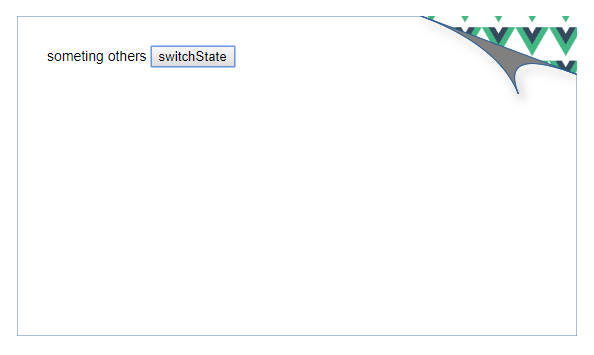
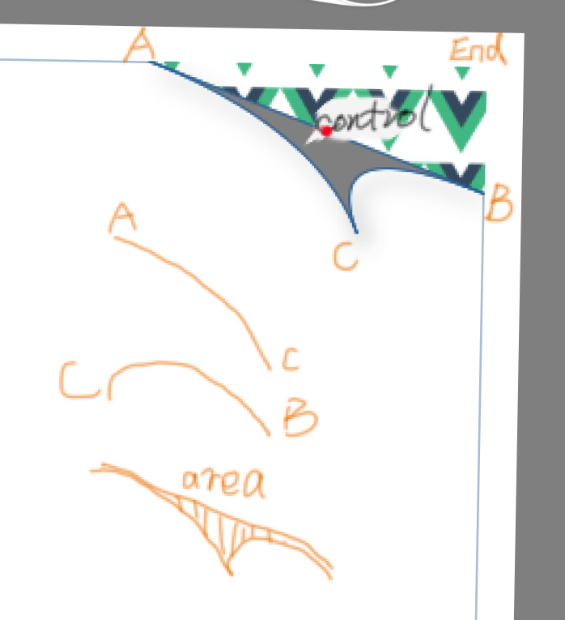

# 这篇文章讲什么？

使用SVG完成卷角的动画效果。

<iframe src="./Corner.html"/>

# 为什么要这么做？

确实,用CSS就能实现卷角效果，很多文章有介绍——[css实现简约的纸张卷角效果][2]、 [不规则卷角][3]、 [纸张边角卷起效果][4]、 [css-backgrounds-4][1]。
>如果你手里有一个锤子，那么......

我的想法是，大部分所谓的“效果”其实是属于“设计”的范围，有很多工具——AI、XD、Inkscape[（Adobe AI开源免费替代品，点击链接查看该工具的作品集)][5] 都能够在设计阶段完成。既然已经完成，就没有必要再进行所谓的“一比一还原”，而只需要对设计产出加上适当的前端代码即可。SVG与位图相比，在交互性上有着天然的优势，按照一套固定的方法，适当加一些JS，就能够实现高质量的效果。

# 实现

Talk is cheap. Show me the code

## 必要的知识点

- web三架马车就不提了
- [SVG][6]
  - [基本图形][7] 本文最重要的是`path`相关的MLQA一定要知道
  - [贝塞尔曲线][8] 按我的理解，就有点素描里面切圆的概念。知道**点**的意义，才能控制图形。
  - [FLIP Your Animations][9] 国内有翻译文，可以自己搜一下。这是一个高性能WEB动画的方法论，我上面提到的**按照一套固定的方法**就是这个。

## 搞事情

### 假装设计给了个好看的 SVG

其实是我为了方便直接按照 560*320 大小画出的SVG图片敲的



拿到原SVG，找到几个关键点（根据基本图形的知识点）


理清楚关键点坐标位置，对应 A、B、C、End

```js
const aStart = {//A
        x: 400,
        y: 0
    },
    bStart = {//B
        x: 560,
        y: 60
    },
    cStart = {//C
        x: 500,
        y: 80
    },
    allEnd = {//End
        x: 560,
        y: 0
    };
```

然后就是路径的绘制：这里的控制点为了方便就是中点，总之意图就是该点可以受控。

```js
dPath() {//矩形
    return `
    M0 0
    L${this.aPoint.x} ${this.aPoint.y}
    L${this.bPoint.x} ${this.bPoint.y}
    L560 320
    L0 320
    Z
    `;
},
qPathUp() {//AC
    return `
    M${this.bPoint.x} ${this.bPoint.y} 
    Q${(this.aPoint.x + this.bPoint.x) / 2} ${(this.aPoint.y + this.bPoint.y) / 2} 
    ${this.cPoint.x} ${this.cPoint.y}
    `;
},
qPathDown() {//
    return `
    M${this.aPoint.x} ${this.aPoint.y} 
    Q${(this.aPoint.x + this.bPoint.x) / 2} ${(this.aPoint.y + this.bPoint.y) / 2} 
    ${this.cPoint.x} ${this.cPoint.y}
    `;
},
areaPath() {
    return `
    M${this.aPoint.x} ${this.aPoint.y}
    L${this.bPoint.x} ${this.bPoint.y}
    Q${(this.aPoint.x + this.bPoint.x) / 2} ${(this.aPoint.y + this.bPoint.y) / 2} 
    ${this.cPoint.x} ${this.cPoint.y}
    Q${(this.aPoint.x + this.bPoint.x) / 2} ${(this.aPoint.y + this.bPoint.y) / 2} 
    ${this.aPoint.x} ${this.aPoint.y} 
    Z
    `;
},
backPath() {
    return `
    M${this.aPoint.x} ${this.aPoint.y}
    L560 0
    L${this.bPoint.x} ${this.bPoint.y}
    Z
    `;
},
```

然后就可以按FLIP的步骤来: 两个状态加上补间动画，这个可以交给第三方库比如**dynamics.js**

```js
 if (this.isOpen) {
        this.isOpen = false;
        dynamics.animate(tshis.aPoint, allEnd, dynamicOptions);
        dynamics.animate(this.bPoint, allEnd, dynamicOptions);
        dynamics.animate(this.cPoint, allEnd, dynamicOptions);
    } else {
        this.isOpen = true;
        dynamics.animate(this.aPoint, aStart, dynamicOptions);
        dynamics.animate(this.bPoint, bStart, dynamicOptions);
        dynamics.animate(this.cPoint, cStart, dynamicOptions);
    }
```

HTML 只加了一个按钮作为切换状态，实际也可以添加拖拽

以上。

# 总结

- 直接使用使用设计产出，减少中间环节，避免无效功夫。
- 找出关键**点**，
- 按照FLIP方法实现

---

抛砖引玉，若有斧正，在此谢过。

[1]:http://dev.w3.org/csswg/css-backgrounds-4
[2]:http://www.uml.org.cn/html/201207164.asp
[3]:https://segmentfault.com/q/1010000007699796
[4]:https://www.cnblogs.com/Mrrabbit/p/7927677.html
[5]:https://inkscape.org/gallery/
[6]:https://developer.mozilla.org/zh-CN/docs/Web/SVG
[7]:https://developer.mozilla.org/zh-CN/docs/Web/SVG/Element
[8]:https://www.zhangxinxu.com/wordpress/2014/06/deep-understand-SVG-path-bezier-curves-command/
[9]:https://aerotwist.com/blog/flip-your-animations/

