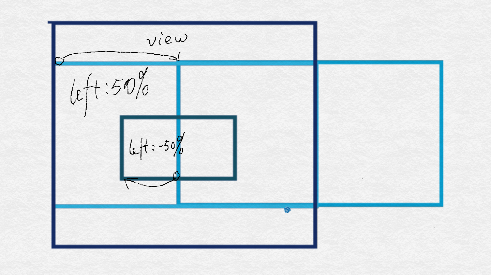

<<<<<<< HEAD
# CSS学习笔记

## 参考资料

1. [《CSS世界》](https://www.zhangxinxu.com/wordpress/2012/04/inline-block-space-remove-%E5%8E%BB%E9%99%A4%E9%97%B4%E8%B7%9D/)
1. [30个你必须记住的CSS选择符](http://yanhaijing.com/css/2014/01/04/the-30-css-selectors-you-must-memorize)
1. [CSS实现水平垂直居中的101010种方式](https://segmentfault.com/a/1190000016389031)
1. [divcss学习网站](http://www.divcss5.com/)
1. [值得参考的css理论：OOCSS、SMACSS与BEM](https://segmentfault.com/a/1190000000704006)
1. [MDN-Web/CSS](https://developer.mozilla.org/zh-CN/docs/Web/CSS)
1. [MDN-Web/CSS/Reference](https://developer.mozilla.org/zh-CN/docs/Web/CSS/Reference)

---
不权威选择器性能排行
max-width
！import

1. ID, e.g. #header
1. Class, e.g. .promo
1. Tag, e.g. div
1. Adjacent sibling, e.g. h2 + p
1. Child, e.g. li > ul
1. Descendant, e.g. ul a*
1. Universal, i.e. *
1. Attribute, e.g. [type=”text”]
1. Pseudo-classes/-elements, e.g. a:hover

## 我所认识的CSS

如果以图灵完备作为标准，显然，HTML5 和CSS都不是一门编程语言。尽管没有如编程语言复杂，CSS学习起来也不轻松。这不轻松主要是体现在细枝末节太多且“不正交”，牵一发而动全身。在不明细节的情况下使用，随着项目的复杂度上升，会使开发和维护人员焦头烂额。所以，学习CSS我认为就是两个方面，一是平时积累，不在多而在吃透，遇到一个搞透一个；二是一定要有一套“最佳实践”，所谓条条大道通罗马，总有一条是最宽畅的：像Bootstrap这种流行的UI库，如何封装不正交的CSS属性成正交的类，这种整体思想很值得学习。

border的样式很重要
if `border：none;` 浏览器不会渲染border; 只有宽度，没有样式，也不会渲染, 所以一定要有样式才有效。

## 继承

颜色，文字，字体间距行高对齐方式，和列表的样式

- 所有元素可继承：visibility和cursor。
- 内联元素可继承：letter-spacing、word-spacing、white-space、line-height、color、font、font-family、font-size、font-style、font-variant、font-weight、text-decoration、text-transform、direction。
- 终端块状元素可继承：text-indent和text-align。
- 列表元素可继承：list-style、list-style-type、list-style-position、list-style-image。

## 选择符

width auto 的作用，默认值的影响。

- 通配符
- 元素选择器
- 类选择器
- ID
- 后代选择器

- 子元素选择器(IE8)
  - Parent > Children
- 相邻兄弟元素
  - Element + Sibling
- 通用兄弟
  - Element ~ Sibling
- 群组选择器(IE6)
  - Element,Element
- 属性选择器
  - Element[attribute]
  - Element[attribute="value"]
  - Element[attribute~="value"]
  - Element[attribute^="value"]
  - Element[attribute$="value"]
  - Element[attribute*="value"]
  - Element[attribute|="value"]
- 伪类选择器
  - [A Whole Bunch of Amazing Stuff Pseudo Elements Can Do](https://css-tricks.com/pseudo-element-roundup/)
  - 动态伪类
    - 锚点伪类
      - :link
      - :visited
    - 用户行为伪类
      - :hover
      - :active
      - :focus
    - 状态伪类
      - :enabled
      - :disabled
      - :checked
- CSS3结构类
  - Element:first-child
  - Element:last-child
  - Element:nth-child(n)**从0开始的n、odd奇数、even偶数**
  - Element:nth-last-child(n)**从最后一个子元素开始计数**
  - Element:nth-of-type(n)
  - Element:nth-last-of-type(n)
  - Element:first-of-type
  - Element:last-of-type
  - Element:only-child
  - Element:only-of-type
  - Element:empty
  - :not(selector)
- 伪元素
  - Element::first-line
  - Element::first-letter
  - Element::before
  - Element::after
  - Element::selection

## 单位

[vm rem em](https://zhuanlan.zhihu.com/p/30413803?group_id=906220704115974144)

[width 100%](https://www.lyblog.net/detail/286.html)

[css样式的百分比都相对于谁](https://www.zhihu.com/question/36079531)

```html
<html style="height: 100%;">
  <body style="height: 100%;">
    <div style="height: 100%;">
```

这在MaterialDesign的Demo当中，使用的是两个div使窗口划分为两个部分，各自按一定比例占满整个窗口。

## 层叠

- 特殊性、权重：ID选择器>Class选择器=伪类>标签名称选择器
- 顺序
- 重要性：！important

style id class :: *
范围越小，权重越高；
后面的覆盖前面的。

## 盒子模型（box）

HTML每个元素都是大大小小的盒子。

我的理解——主要是分为两种：inline和block。
在两者的基础特性上，又有其他的组合效果如——inline-block

[标准模式与怪异模式对于渲染页面的影响](https://juejin.im/post/5a44aa4d518825146b10d69d?utm_medium=fe&utm_source=weixinqun)

- box-sizing: border-box;content-box;
- boder-box:border+padding+content
- boder-

## 行内元素（inline）和块级元素（block）

> [说说行内元素和块级元素](http://www.jianshu.com/p/d69878549d92)

### inline

1. 和其他元素都在一行上；
1. 元素的高度、宽度及顶部和底部边距不可设置；
1. **包裹**里面的文字或图片，尽量收缩：元素的宽度就是它包含的文字或图片的宽度，不可改变。

### block

1. 一个块级元素独占一行；
1. 元素的高度、宽度、行高以及顶和底边距都可设置；
1. **撑**：元素宽度在不设置的情况下，是它本身父容器的100%（和父元素的宽度一致），除非设定一个宽度。

#### 宽度和高度

css内定义的宽（width）和高（height），指的是填充以里的内容范围。 因此一个元素实际宽度（盒子的宽度）=左边界+左边框+左填充+内容宽度+右填充+右边框+右边界。
> 
- 标准盒子模型 ＝ margin + border + padding + content （content =  width | height）
- IE盒子模型 ＝ margin + content （content = border + padding + width | height）

- 
- [深入理解父元素与子元素的width关系](http://www.cnblogs.com/zhuzhenwei918/p/6389567.html)

### inline-block

`absolute`和`float`可是元素隐性变为 `inline-block`

1. 和其他元素都在一行上；
1. 元素的高度、宽度、行高以及顶和底边距都可设置。

值|描述
---|---
content-box|这是由 CSS2.1 规定的宽度高度行为。 宽度和高度分别应用到元素的内容框。 在宽度和高度之外绘制元素的内边距和边框。
border-box| 为元素设定的宽度和高度决定了元素的边框盒。 就是说，为元素指定的任何内边距和边框都将在已设定的宽度和高度内进行绘制。 通过从已设定的宽度和高度分别减去边框和内边距才能得到内容的宽度和高度。
inherit|规定应从父元素继承 box-sizing 属性的值。

[如何让 height:100%; 起作用](http://www.webhek.com/post/css-100-percent-height.html)
[如何让 height:100%; 起作用](http://www.divcss5.com/rumen/r613.shtml)
高度跟父元素有关，所以如果要使height起作用，需要

行内元素（伪） | 语义| |块级元素| 语义
---|---|---|---|---
a        | 锚                                 | | address    | 地址
abbr     | 缩写                               | | blockquote | 块引用
acronym  | 首字                               | | center     | 居中对齐块
b        | 粗体（不推荐）                     | | dir        | 目录列表
bdo      | bidi override                      | | **div**    | （无语义的块级元素）
big      | 大字体                             | | dl         | 定义列表
br       | 换行                               | | fieldset   | form表单控制组（group）
cite     | 引用                               | | form       | 交互表单
code     | 计算机代码（在引用源码的时候需要） | | h1         | 大标题
dfn      | 定义字段                           | | h2         | 副标题
em       | 强调                               | | h3         | 3级标题
font     | 字体设定（不推荐）                 | | h4         | 4级标题
i        | 斜体                               | | h5         | 5级标题
~~img~~      | 图片                               | | h6         | 6级标题
~~input~~    | 输入框                             | | hr         | 水平分隔线
kbd      | 定义键盘文本                       | | isindex    | input prompt
label    | 表格标签                           | | menu       | 菜单列表
q        | 短引用                             | | noframes   | frames可选内容（对于不支持frame的浏览器显示此区块内容）
s        | 中划线（不推荐）                   | | noscript   | 可选脚本内容（对于不支持script的浏览器显示此内容）
samp     | 定义范例计算机代码                 | | ol         | 排序列表
select   | 项目选择                           | | p          | 段落
small    | 小字体文本                         | | pre        | 格式化文本
**span** | 常用内联容器，定义文本内区块       | | table      | 表格
strike   | 中划线                             | | ul         | 非排序列表
strong   | 粗体强调                           |
sub      | 下标                               |
sup      | 上标                               |
textarea | 多行文本输入框                     |
tt       | 电传文本                           |
u        | 下划线                             |
var      | 定义变                             |

- 转换：float\display\position

## 边框与圆角

### 圆角

[border-radius](https://developer.mozilla.org/zh-CN/docs/Web/CSS/border-radius)
顺序、值 、`/`

### 盒阴影

[box-shadow](https://developer.mozilla.org/zh-CN/docs/Web/CSS/box-shadow)

- inset
- offset-x、 offset-y
- blur-radius 是否模糊，只能为正值
- spread-radius
- color

### 边界图片

[border-image](https://developer.mozilla.org/zh-CN/docs/Web/CSS/border-image)

## 背景与渐变

figure
img 图
figcaption 图题

### [背景](https://developer.mozilla.org/zh-CN/docs/Web/CSS/background)

- background-clip:padding-box|border-box|content-box
- background-origin:padding-box|border-box|content-box
- background-size:length|percentage|cover|contain
- background-image:url()
- background:color position size repeat origin clip attachment image

[滤镜](https://developer.mozilla.org/en-US/docs/Web/CSS/filter)filter:blur(5px);模糊
[高级CSS filters](https://www.w3cplus.com/css3/advanced-css-filters.html)

- background-image:url();//相对路径是相对样式表文件而言
- GIF JEPG PNG8 24 32
  - 个人理解两个方面：
    - 动画就是gif alpha图就是png 一般高压缩又色彩丰富就是jpeg **（这个角度就差不多够了）**
    - GIF PNG8/JPEG PNG24 PNG32 都是png质量更好但是size大，png有alpha渐变（PNG24 alpha只有一种颜色）
- background-repeat: repeat no-repeat repeat-x repeat-y round space

### 定位

- background-position：
  - 关键字：left center right top bottom ；
  - 百分比：把指定的背景图比例位置与目标元素相同的比例位置对齐；

### 固定

- background-attachment：
  - fixed scroll

### 背景的起点和显示区域

### 渐变

linear-gradient（角度deg，起始颜色 20%，transparent），多个渐变色可叠加，换不同角度
radial-gradient（closest-side closest-corner farthest-side farthest-corner)

- [linear-gradient](https://developer.mozilla.org/zh-CN/docs/Web/CSS/linear-gradient)(direction,color-stop1,color-stop2,...)
- [radial-gradient](https://developer.mozilla.org/zh-CN/docs/Web/CSS/radial-gradient)(direction,color-stop1,color-stop2,...)

```css
background: linear-gradient(cyan, transparent),
            linear-gradient(225deg, magenta, transparent),
            linear-gradient(45deg, yellow, transparent);
```

## [Transform](https://developer.mozilla.org/zh-CN/docs/Web/CSS/transform)

- rotate( angle deg):正数顺时针
- translate(x,y)：移动
  - translateX()
  - translateY()
- scale(x,y):缩放
  - scaleX()
  - scaleY()
- [skew](https://developer.mozilla.org/en-US/docs/Web/CSS/transform-function/skew):斜拉
  - skewX()
  - skewY()
- [matrix](https://developer.mozilla.org/en-US/docs/Web/CSS/transform-function/matrix)
  - [IE矩阵滤镜Matrix旋转与缩放及结合transform的拓展](https://www.zhangxinxu.com/wordpress/2011/03/ie矩阵滤镜matrix下旋转与缩放及结合transform的拓展/)
  - [理解CSS3 transform中的Matrix(矩阵)](https://www.zhangxinxu.com/wordpress/2012/06/css3-transform-matrix-矩阵/)

## [Transition](https://developer.mozilla.org/zh-CN/docs/Web/CSS/transition)

- tansition-property:none|all|property
- tansition-duration:
- tansition-timing-function:ease|linear|ease-in|ease-out|ease-in-out|step-start|step-end|cubic-bezier()
  - linear :线性过渡。等同于贝塞尔曲线(0.0, 0.0, 1.0, 1.0)
  - ease :平滑过渡。等同于贝塞尔曲线(0.25, 0.1, 0.25, 1.0)
  - ease-in :由慢到快。等同于贝塞尔曲线(0.42, 0, 1.0, 1.0)
  - ease-out :由快到慢。等同于贝塞尔曲线(0, 0, 0.58, 1.0)
  - ease-in-out :由慢到快再到慢。等同于贝塞尔曲线(0.42, 0, 0.58, 1.0)
- tansition-delay

## [动画（animation）](https://developer.mozilla.org/zh-CN/docs/Web/CSS/animation)

- animation-name:keyframename|none;
- animation-duration:
- animation-timing-function:ease|linear|ease-in|ease-out|ease-in-out|step-start|step-end|cubic-bezier()
  - linear :线性过渡。等同于贝塞尔曲线(0.0, 0.0, 1.0, 1.0)
  - ease :平滑过渡。等同于贝塞尔曲线(0.25, 0.1, 0.25, 1.0)
  - ease-in :由慢到快。等同于贝塞尔曲线(0.42, 0, 1.0, 1.0)
  - ease-out :由快到慢。等同于贝塞尔曲线(0, 0, 0.58, 1.0)
  - ease-in-out :由慢到快再到慢。等同于贝塞尔曲线(0.42, 0, 0.58, 1.0)
- animation-delay:
- animation-iteration-count:infinite|(number);
- animation-direction:normal|reverse|alternate|alternate-reverse|initial|inherit;
- animation-fill-mode:none|forwards|backwards|both|initial|inherit;
- animation-play-state:paused|running

```css
@keyframes animationname{
  keyframes-selector{
    css-styles;
  }
}
```

## 文字排版

“文字”有什么？

- font-family:"微软雅黑";
- font-size:20px;
- color:green;//前景色
- font-weight:blod;
- font-style:italic;
- text-decrotion:none;||text-decoration:line-through;//装饰文本《HTML5于CSS3基础教程》一般用作锚去除下划线或者价格删除线。
- block:text-indent:2em;//行缩进
- block:line-height:2em;//行高
- letter-spacing:50px;||word-spacing//字母间距||单词间距
- text-align:center;||
- vertical-align:center;
- [Label的两端对齐](https://www.zhangxinxu.com/wordpress/2011/03/displayinline-blocktext-alignjustify%E4%B8%8B%E5%88%97%E8%A1%A8%E7%9A%84%E4%B8%A4%E7%AB%AF%E5%AF%B9%E9%BD%90%E5%B8%83%E5%B1%80/)

## 布局

元素有三种布局模型：

- [Layout Generators](http://www.pagecolumn.com/)
- [Templated](https://templated.co/)
- [Layout Gala](https://blog.html.it/layoutgala/index.html)
- [CSS布局](http://zh.learnlayout.com/position.html)
- [position](https://developer.mozilla.org/zh-CN/docs/Web/CSS/position)
- [布局的下一次革新](https://juejin.im/post/5b85586ce51d4538c77a9cc1?utm_medium=fe&utm_source=weixinqun)

1. 流动模型（Flow）/ 标准文档流
1. 浮动模型 (Float)
1. 层模型（Layer）

### 一般流程

1. 设计图
1. 找出盒子
1. 区别 block inline，选择恰当的盒子
1. 背景图片与图片的选用策略
1. 复用，但是不要过渡设计
1. 分层的应用 z-index position

盒子模型最主要的定位方式
position:static relative absolute fixed transform非none

与display：flex

布局的策略：从左到右，从上到下；
vertical-align：top
line-height

## 流 （Flow）

IE 8，对应CSS2.1，比较完正的部分。
标准文档流， “流”是基本的定位和布局机制：div、span就是俩代表，具有“自适应”：

1. 块状元素都会在所处的包含块内自上而下按顺序垂直延伸分布
1. 内联元素都会在所处的包含元素内从左到右水平分布显示。

### 浮动模型 (Float)

浮动使之脱离标准文档流。效果类似inline-block且无元素间间距。
浮动用来设置文字环绕，也可以用来布局，**bootstrap栅栏系统**是利用浮动设计的。

- [清除浮动](http://nicolasgallagher.com/micro-clearfix-hack/)
- fix float所产生的塌陷/元素下坠
  - [利用:after伪类元素清除](http://www.html-js.com/article/2203)
  - [Why does overflow hidden stop floating elements escaping their container?](https://stackoverflow.com/questions/9193214/why-does-overflow-hidden-stop-floating-elements-escaping-their-container)
    - [BFC 块级格式化上下文](http://web.jobbole.com/83149/)+ [CSS之BFC详解](http://www.html-js.com/article/1866)+[](http://www.10tiao.com/html/59/201712/2651553261/1.html)
    **BFC特性**
    1. 内部的Box会在垂直方向，从顶部开始一个接一个地放置。
    1. Box垂直方向的距离由margin决定。属于同一个BFC的两个相邻Box的margin会发生叠加
    1. 每个元素的margin box的左边， 与包含块border box的左边相接触(对于从左往右的格式化，否则相反)。即使存在浮动也是如此。
    1. BFC的区域不会与float box叠加。
    1. BFC就是页面上的一个隔离的独立容器，容器里面的子元素不会影响到外面的元素，反之亦然。
    1. 计算BFC的高度时，浮动元素也参与计算。

---

作用:

    1. 说的
    1. 解决margin叠加问题
    1. 布局[CSS之BFC详解](http://www.html-js.com/article/1866)
    1. 用于清除浮动，计算BFC高度.
---

`overflow: hidden;`只是创建BFC的方式之一，比较常用。

- `display: table` 可能引发响应性问题
- `overflow: scroll` 可能产生多余的滚动条
- `float: left` 将把元素移至左侧，并被其他元素环绕
- `overflow: hidden` 将裁切溢出元素

Inline-block和浮动布局的区别？

#### 层模型

1. 绝对定位(position: absolute)
    - 将元素从文档流中拖出来，然后使用left、right、top、bottom属性相对于其最接近的一个具有定位属性的父包含块进行绝对定位。如果不存在这样的包含块，则相对于body元素，即相对于浏览器窗口。
1. 相对定位(position: relative)
    - 通过left、right、top、bottom属性确定元素在正常文档流中的偏移位置。
1. 固定定位(position: fixed)：位置效果使用`background-attachment:fixed`
    - position:fixed;并不只是相对于窗口定位：CSS3的transform会影响定位；
    - [相对于父元素的FIXED定位的实现](http://www.cnblogs.com/biyesheng/p/6386176.html)
    - [相对于父元素的FIXED定位的实现:transform](https://code.w3ctech.com/detail/1305)

<iframe height='265' scrolling='no' title='相对于父元素的FIXED定位的实现' src='//codepen.io/singlone/embed/MBXdWP/?height=265&theme-id=0&default-tab=css,result&embed-version=2' frameborder='no' allowtransparency='true' allowfullscreen='true' style='width: 100%;'>See the Pen <a href='https://codepen.io/singlone/pen/MBXdWP/'>相对于父元素的FIXED定位的实现</a> by ShoneSingLone (<a href='https://codepen.io/singlone'>@singlone</a>) on <a href='https://codepen.io'>CodePen</a>.
</iframe>

## 固定

### 不固定

#### 浮动

#### 流式布局

#### 响应式布局

响应式与自适应semantic,都要用媒体查询，但是响应式是根据一套HTML结构来设计不同的样式，而自适应是可以根据不同的结构设计对应的样式。响应式可遭罪了，绞尽脑汁，在设计结构的时候就要考虑到不同的展示样式。自适应一套结构一套样式，看起来费劲，实际做起来的就是上了高速公路，直达。修改起来也是松耦合，相互之间不影响，比起响应式的过度设计不知道高到哪里去了。Bootstrap那种响应式的就当学习和一般搭搭架子用用...

### flex布局

[深入理解 flex 布局以及计算](https://www.w3cplus.com/css3/flexbox-layout-and-calculation.html)
[Flex 布局教程](http://www.ruanyifeng.com/blog/2015/07/flex-grammar.html)
[Flex 布局教程 实例](http://www.ruanyifeng.com/blog/2015/07/flex-examples.html)
[Flex 布局教程 demo](http://static.vgee.cn/static/index.html)
[FLEX-LAYOUT](https://github.com/Coffcer/flex-layout)
[solved-by-flexbox/](https://hufan-akari.github.io/solved-by-flexbox/)

 flex分为两个部分：一个是container 用作包裹；另一个是item，被包裹的元素。container可以指定排列的方向（flex-direction）和换行的方式（flex-wrap）。

 **flex-direction**属性指定了内部元素是如何在 flex 容器中布局的，定义了主轴的方向(正方向或反方向)。意思就是当`flex-directin:column;`时，justify axis变成了Y轴。

 注意到这里的baseline和content的around就可以理解到这两者的区别：content是main和cross上的分部，而align-items就是item内部的布局基准。align又有stretch属性，在cross轴上特有。
 尽量是不要自动换行，设计为row和column的方式：指定column。

[mindmap](http://naotu.baidu.com/file/c629a9abd17ecd60f59bc98dcfe5a4fe)

### 瀑布流

- [瀑布流布局的实现步步升级（原生JS）](http://www.dengzhr.com/js/405)
- [Web前端实现瀑布流的几种方法](http://www.jianshu.com/p/d4ca937c6f96?from=jiantop.com)
- [Web前端实现瀑布流的几js实现瀑布流的三种方式比较，js瀑布三种方式种方法](http://www.jianshu.com/p/d4ca937c6f96?from=jiantop.com)
- [纯js实现瀑布流布局及ajax动态新增数据](https://www.teakki.com/p/5901f3cab819c55a2789c289)
- [多行文本'...'](https://qianduan.group/posts/5a9ff0e80cf6b624d2239cc8)

### [居中](https://www.w3cplus.com/css/centering-css-complete-guide.html)

[CSS实现水平垂直居中的101010种方式](https://zhuanlan.zhihu.com/p/44439903)


1. 水平居中
    1. 行内元素：通过给父元素设置 text-align:center
    1. 块状元素：
        1. 定宽：满足定宽和块状两个条件的元素是可以通过设置“左右margin”值为“auto”来实现居中的。
        1. 不定宽：
            1. 加入 table 标签：table标签的长度自适应性---即不定义其长度也不默认父元素body的长度（table其长度根据其内文本长度决定），因此可以看做一个定宽度块元素，然后再利用定宽度块状居中的margin的方法，使其水平居中。
            1. 设置 `display: inline` 方法：使block元素变为inline，类似行内元素的方法
            1. 设置 position:relative 和 left:50%：利用 相对定位 的方式，将元素向左偏移 50% ，即达到居中的目的。

<iframe height='265' scrolling='no' title='不定宽块状元素水平居中' src='//codepen.io/singlone/embed/djKEMM/?height=265&theme-id=0&default-tab=css,result&embed-version=2' frameborder='no' allowtransparency='true' allowfullscreen='true' style='width: 100%;'>See the Pen <a href='https://codepen.io/singlone/pen/djKEMM/'>不定宽块状元素水平居中</a> by ShoneSingLone (<a href='https://codepen.io/singlone'>@singlone</a>) on <a href='https://codepen.io'>CodePen</a>.
</iframe>



1. 垂直居中
    1. 父元素高度确定
        1. 单行文本:通过设置height 和 line-height 高度一致来实现的。
        但是要理解如果不设置height，那么height是由内部元素撑开，即如果只有一个单行文本，只需要设置line-height就行了
        <script src='http://runjs.cn/gist/11yepad9/all'></script>

            - ```
            <style>
            .container{
                height:100px;
                line-height:100px;
                background:#999;
            }
            </style>
            ```
        1. 多行文本或图片：
            1. 使用插入 table  (包括tbody、tr、td)标签，同时设置 vertical-align：middle。
            1. 在 chrome、firefox 及 IE8 以上的浏览器下可以设置块级元素的 display 为 table-cell（设置为表格单元显示），激活 vertical-align 属性，但注意 IE6、7 并不支持这个样式, 兼容性比较差。相当于内置了方法1.

[css3-tooltip](http://www.menucool.com/tooltip/css3-tooltip)
[css3-tooltip](http://caibaojian.com/css3-tooltip.html)

[flexboxfroggy](http://flexboxfroggy.com)

## 

- [使用 CSS overscroll-behavior 控制滚动行为：自定义下拉刷新和溢出效果](https://github.com/dev-reading/fe/blob/master/articles/2017-11-15-overscroll-behavior.md)
- [禁止遮罩层以下屏幕滑动----正解(更新版)](http://www.cnblogs.com/gaohui/p/5819777.html)

## @font-face

glyphicons 矢量图


## 变形 过渡 动画

- transform:
  - rotate
  - scale
  - translate:(X/Y/Z)
  - skew
  - origin

- transition:
  - transition-property:transform length opcity font color margin border padding 
  - transition-duration:
  - transition-timing-function: linear ease ease-in ease-out ease-in-out cubic-bezier
  - transition-delay:

- animation
  - @keyframes
  - animation-name：
  - animation-duration：
  - animation-timing-function: ease-in-out cubic-bezier
  - animation-delay:
  - animation-itration-count：infinite（无限）
  - animation-direction： alternate(交替轮流)
  - animation-fill-mode: forwards
  - animation-play-state: running paused

 [CSS3 逐渐发光的方格边框](http://caibaojian.com/css-light.html)
 

## 装饰表格和表单

表格是用来展示数据的。

- table
  - tr
    - td

padding 
text—align:left right center justfied
vertical-align:top baseline middle bottom

### 创建边框

border:针对table的border和th的border效果不一样

- 去掉双重边框：border-collapse：separator：分开并且边重叠 collapse：
- 圆角：在border-collapse默认为separator的情况下可以使用圆角否则就不起作用为直角
- 控制单元格之间的间隙：border-spaceing:用于控制边框间的间隙

### 装饰行和列

- nth-of-type：子类型选择符

### 装饰表单

[10 CSS HTML Form Designs](https://www.sanwebe.com/2014/08/css-html-forms-designs)

label 标记通常以下面两种方式中的一种来和表单控件相联系：将表单控件作为标记标签的内容，这样的就是隐式形式，或者为 `<label>` 标签下的 for 属性命名一个目标表单 id，这样就是显式形式。

```html
显式的联系：
<label for="SSN">Social Security Number:</label>
<input type="text" name="SocSecNum" id="SSN" />

隐式的联系：
<label>Date of Birth: <input type="text" name="DofB" /></label>
```

通常是一个label和一个input
label就设定好宽度，右对齐，间隔margin
input

cover contain
[background-size](https://developer.mozilla.org/zh-CN/docs/Web/CSS/background-size)
=======
# CSS学习笔记

## 参考资料

1. [《CSS世界》](https://www.zhangxinxu.com/wordpress/2012/04/inline-block-space-remove-%E5%8E%BB%E9%99%A4%E9%97%B4%E8%B7%9D/)
1. [30个你必须记住的CSS选择符](http://yanhaijing.com/css/2014/01/04/the-30-css-selectors-you-must-memorize)
1. [CSS实现水平垂直居中的101010种方式](https://segmentfault.com/a/1190000016389031)
1. [divcss学习网站](http://www.divcss5.com/)
1. [值得参考的css理论：OOCSS、SMACSS与BEM](https://segmentfault.com/a/1190000000704006)
1. [MDN-Web/CSS](https://developer.mozilla.org/zh-CN/docs/Web/CSS)
1. [MDN-Web/CSS/Reference](https://developer.mozilla.org/zh-CN/docs/Web/CSS/Reference)

---
不权威选择器性能排行
max-width
！import

1. ID, e.g. #header
1. Class, e.g. .promo
1. Tag, e.g. div
1. Adjacent sibling, e.g. h2 + p
1. Child, e.g. li > ul
1. Descendant, e.g. ul a*
1. Universal, i.e. *
1. Attribute, e.g. [type=”text”]
1. Pseudo-classes/-elements, e.g. a:hover

## 我所认识的CSS

如果以图灵完备作为标准，显然，HTML5 和CSS都不是一门编程语言。尽管没有如编程语言复杂，CSS学习起来也不轻松。这不轻松主要是体现在细枝末节太多且“不正交”，牵一发而动全身。在不明细节的情况下使用，随着项目的复杂度上升，会使开发和维护人员焦头烂额。所以，学习CSS我认为就是两个方面，一是平时积累，不在多而在吃透，遇到一个搞透一个；二是一定要有一套“最佳实践”，所谓条条大道通罗马，总有一条是最宽畅的：像Bootstrap这种流行的UI库，如何封装不正交的CSS属性成正交的类，这种整体思想很值得学习。

border的样式很重要
if `border：none;` 浏览器不会渲染border; 只有宽度，没有样式，也不会渲染, 所以一定要有样式才有效。

## 继承

颜色，文字，字体间距行高对齐方式，和列表的样式

- 所有元素可继承：visibility和cursor。
- 内联元素可继承：letter-spacing、word-spacing、white-space、line-height、color、font、font-family、font-size、font-style、font-variant、font-weight、text-decoration、text-transform、direction。
- 终端块状元素可继承：text-indent和text-align。
- 列表元素可继承：list-style、list-style-type、list-style-position、list-style-image。

## 选择符

width auto 的作用，默认值的影响。

- 通配符
- 元素选择器
- 类选择器
- ID
- 后代选择器

- 子元素选择器(IE8)
  - Parent > Children
- 相邻兄弟元素
  - Element + Sibling
- 通用兄弟
  - Element ~ Sibling
- 群组选择器(IE6)
  - Element,Element
- 属性选择器
  - Element[attribute]
  - Element[attribute="value"]
  - Element[attribute~="value"]
  - Element[attribute^="value"]
  - Element[attribute$="value"]
  - Element[attribute*="value"]
  - Element[attribute|="value"]
- 伪类选择器
  - [A Whole Bunch of Amazing Stuff Pseudo Elements Can Do](https://css-tricks.com/pseudo-element-roundup/)
  - 动态伪类
    - 锚点伪类
      - :link
      - :visited
    - 用户行为伪类
      - :hover
      - :active
      - :focus
    - 状态伪类
      - :enabled
      - :disabled
      - :checked
- CSS3结构类
  - Element:first-child
  - Element:last-child
  - Element:nth-child(n)**从0开始的n、odd奇数、even偶数**
  - Element:nth-last-child(n)**从最后一个子元素开始计数**
  - Element:nth-of-type(n)
  - Element:nth-last-of-type(n)
  - Element:first-of-type
  - Element:last-of-type
  - Element:only-child
  - Element:only-of-type
  - Element:empty
  - :not(selector)
- 伪元素
  - Element::first-line
  - Element::first-letter
  - Element::before
  - Element::after
  - Element::selection

## 单位

[vm rem em](https://zhuanlan.zhihu.com/p/30413803?group_id=906220704115974144)

[width 100%](https://www.lyblog.net/detail/286.html)

[css样式的百分比都相对于谁](https://www.zhihu.com/question/36079531)

```html
<html style="height: 100%;">
  <body style="height: 100%;">
    <div style="height: 100%;">
```

这在MaterialDesign的Demo当中，使用的是两个div使窗口划分为两个部分，各自按一定比例占满整个窗口。

## 层叠

- 特殊性、权重：ID选择器>Class选择器=伪类>标签名称选择器
- 顺序
- 重要性：！important

style id class :: *
范围越小，权重越高；
后面的覆盖前面的。

## 盒子模型（box）

HTML每个元素都是大大小小的盒子。

我的理解——主要是分为两种：inline和block。
在两者的基础特性上，又有其他的组合效果如——inline-block

[标准模式与怪异模式对于渲染页面的影响](https://juejin.im/post/5a44aa4d518825146b10d69d?utm_medium=fe&utm_source=weixinqun)

- box-sizing: border-box;content-box;
- boder-box:border+padding+content
- boder-

## 行内元素（inline）和块级元素（block）

> [说说行内元素和块级元素](http://www.jianshu.com/p/d69878549d92)

### inline

1. 和其他元素都在一行上；
1. 元素的高度、宽度及顶部和底部边距不可设置；
1. **包裹**里面的文字或图片，尽量收缩：元素的宽度就是它包含的文字或图片的宽度，不可改变。

### block

1. 一个块级元素独占一行；
1. 元素的高度、宽度、行高以及顶和底边距都可设置；
1. **撑**：元素宽度在不设置的情况下，是它本身父容器的100%（和父元素的宽度一致），除非设定一个宽度。

#### 宽度和高度

css内定义的宽（width）和高（height），指的是填充以里的内容范围。 因此一个元素实际宽度（盒子的宽度）=左边界+左边框+左填充+内容宽度+右填充+右边框+右边界。
> 
- 标准盒子模型 ＝ margin + border + padding + content （content =  width | height）
- IE盒子模型 ＝ margin + content （content = border + padding + width | height）

- 
- [深入理解父元素与子元素的width关系](http://www.cnblogs.com/zhuzhenwei918/p/6389567.html)

### inline-block

`absolute`和`float`可是元素隐性变为 `inline-block`

1. 和其他元素都在一行上；
1. 元素的高度、宽度、行高以及顶和底边距都可设置。

值|描述
---|---
content-box|这是由 CSS2.1 规定的宽度高度行为。 宽度和高度分别应用到元素的内容框。 在宽度和高度之外绘制元素的内边距和边框。
border-box| 为元素设定的宽度和高度决定了元素的边框盒。 就是说，为元素指定的任何内边距和边框都将在已设定的宽度和高度内进行绘制。 通过从已设定的宽度和高度分别减去边框和内边距才能得到内容的宽度和高度。
inherit|规定应从父元素继承 box-sizing 属性的值。

[如何让 height:100%; 起作用](http://www.webhek.com/post/css-100-percent-height.html)
[如何让 height:100%; 起作用](http://www.divcss5.com/rumen/r613.shtml)
高度跟父元素有关，所以如果要使height起作用，需要

行内元素（伪） | 语义| |块级元素| 语义
---|---|---|---|---
a        | 锚                                 | | address    | 地址
abbr     | 缩写                               | | blockquote | 块引用
acronym  | 首字                               | | center     | 居中对齐块
b        | 粗体（不推荐）                     | | dir        | 目录列表
bdo      | bidi override                      | | **div**    | （无语义的块级元素）
big      | 大字体                             | | dl         | 定义列表
br       | 换行                               | | fieldset   | form表单控制组（group）
cite     | 引用                               | | form       | 交互表单
code     | 计算机代码（在引用源码的时候需要） | | h1         | 大标题
dfn      | 定义字段                           | | h2         | 副标题
em       | 强调                               | | h3         | 3级标题
font     | 字体设定（不推荐）                 | | h4         | 4级标题
i        | 斜体                               | | h5         | 5级标题
~~img~~      | 图片                               | | h6         | 6级标题
~~input~~    | 输入框                             | | hr         | 水平分隔线
kbd      | 定义键盘文本                       | | isindex    | input prompt
label    | 表格标签                           | | menu       | 菜单列表
q        | 短引用                             | | noframes   | frames可选内容（对于不支持frame的浏览器显示此区块内容）
s        | 中划线（不推荐）                   | | noscript   | 可选脚本内容（对于不支持script的浏览器显示此内容）
samp     | 定义范例计算机代码                 | | ol         | 排序列表
select   | 项目选择                           | | p          | 段落
small    | 小字体文本                         | | pre        | 格式化文本
**span** | 常用内联容器，定义文本内区块       | | table      | 表格
strike   | 中划线                             | | ul         | 非排序列表
strong   | 粗体强调                           |
sub      | 下标                               |
sup      | 上标                               |
textarea | 多行文本输入框                     |
tt       | 电传文本                           |
u        | 下划线                             |
var      | 定义变                             |

- 转换：float\display\position

## 边框与圆角

### 圆角

[border-radius](https://developer.mozilla.org/zh-CN/docs/Web/CSS/border-radius)
顺序、值 、`/`

### 盒阴影

[box-shadow](https://developer.mozilla.org/zh-CN/docs/Web/CSS/box-shadow)

- inset
- offset-x、 offset-y
- blur-radius 是否模糊，只能为正值
- spread-radius
- color

### 边界图片

[border-image](https://developer.mozilla.org/zh-CN/docs/Web/CSS/border-image)

## 背景与渐变

figure
img 图
figcaption 图题

### [背景](https://developer.mozilla.org/zh-CN/docs/Web/CSS/background)

- background-clip:padding-box|border-box|content-box
- background-origin:padding-box|border-box|content-box
- background-size:length|percentage|cover|contain
- background-image:url()
- background:color position size repeat origin clip attachment image

[滤镜](https://developer.mozilla.org/en-US/docs/Web/CSS/filter)filter:blur(5px);模糊
[高级CSS filters](https://www.w3cplus.com/css3/advanced-css-filters.html)

- background-image:url();//相对路径是相对样式表文件而言
- GIF JEPG PNG8 24 32
  - 个人理解两个方面：
    - 动画就是gif alpha图就是png 一般高压缩又色彩丰富就是jpeg **（这个角度就差不多够了）**
    - GIF PNG8/JPEG PNG24 PNG32 都是png质量更好但是size大，png有alpha渐变（PNG24 alpha只有一种颜色）
- background-repeat: repeat no-repeat repeat-x repeat-y round space

### 定位

- background-position：
  - 关键字：left center right top bottom ；
  - 百分比：把指定的背景图比例位置与目标元素相同的比例位置对齐；

### 固定

- background-attachment：
  - fixed scroll

### 背景的起点和显示区域

### 渐变

linear-gradient（角度deg，起始颜色 20%，transparent），多个渐变色可叠加，换不同角度
radial-gradient（closest-side closest-corner farthest-side farthest-corner)

- [linear-gradient](https://developer.mozilla.org/zh-CN/docs/Web/CSS/linear-gradient)(direction,color-stop1,color-stop2,...)
- [radial-gradient](https://developer.mozilla.org/zh-CN/docs/Web/CSS/radial-gradient)(direction,color-stop1,color-stop2,...)

```css
background: linear-gradient(cyan, transparent),
            linear-gradient(225deg, magenta, transparent),
            linear-gradient(45deg, yellow, transparent);
```

## [Transform](https://developer.mozilla.org/zh-CN/docs/Web/CSS/transform)

- rotate( angle deg):正数顺时针
- translate(x,y)：移动
  - translateX()
  - translateY()
- scale(x,y):缩放
  - scaleX()
  - scaleY()
- [skew](https://developer.mozilla.org/en-US/docs/Web/CSS/transform-function/skew):斜拉
  - skewX()
  - skewY()
- [matrix](https://developer.mozilla.org/en-US/docs/Web/CSS/transform-function/matrix)
  - [IE矩阵滤镜Matrix旋转与缩放及结合transform的拓展](https://www.zhangxinxu.com/wordpress/2011/03/ie矩阵滤镜matrix下旋转与缩放及结合transform的拓展/)
  - [理解CSS3 transform中的Matrix(矩阵)](https://www.zhangxinxu.com/wordpress/2012/06/css3-transform-matrix-矩阵/)

## [Transition](https://developer.mozilla.org/zh-CN/docs/Web/CSS/transition)

- tansition-property:none|all|property
- tansition-duration:
- tansition-timing-function:ease|linear|ease-in|ease-out|ease-in-out|step-start|step-end|cubic-bezier()
  - linear :线性过渡。等同于贝塞尔曲线(0.0, 0.0, 1.0, 1.0)
  - ease :平滑过渡。等同于贝塞尔曲线(0.25, 0.1, 0.25, 1.0)
  - ease-in :由慢到快。等同于贝塞尔曲线(0.42, 0, 1.0, 1.0)
  - ease-out :由快到慢。等同于贝塞尔曲线(0, 0, 0.58, 1.0)
  - ease-in-out :由慢到快再到慢。等同于贝塞尔曲线(0.42, 0, 0.58, 1.0)
- tansition-delay

## [动画（animation）](https://developer.mozilla.org/zh-CN/docs/Web/CSS/animation)

- animation-name:keyframename|none;
- animation-duration:
- animation-timing-function:ease|linear|ease-in|ease-out|ease-in-out|step-start|step-end|cubic-bezier()
  - linear :线性过渡。等同于贝塞尔曲线(0.0, 0.0, 1.0, 1.0)
  - ease :平滑过渡。等同于贝塞尔曲线(0.25, 0.1, 0.25, 1.0)
  - ease-in :由慢到快。等同于贝塞尔曲线(0.42, 0, 1.0, 1.0)
  - ease-out :由快到慢。等同于贝塞尔曲线(0, 0, 0.58, 1.0)
  - ease-in-out :由慢到快再到慢。等同于贝塞尔曲线(0.42, 0, 0.58, 1.0)
- animation-delay:
- animation-iteration-count:infinite|(number);
- animation-direction:normal|reverse|alternate|alternate-reverse|initial|inherit;
- animation-fill-mode:none|forwards|backwards|both|initial|inherit;
- animation-play-state:paused|running

```css
@keyframes animationname{
  keyframes-selector{
    css-styles;
  }
}
```

## 文字排版

“文字”有什么？

- font-family:"微软雅黑";
- font-size:20px;
- color:green;//前景色
- font-weight:blod;
- font-style:italic;
- text-decrotion:none;||text-decoration:line-through;//装饰文本《HTML5于CSS3基础教程》一般用作锚去除下划线或者价格删除线。
- block:text-indent:2em;//行缩进
- block:line-height:2em;//行高
- letter-spacing:50px;||word-spacing//字母间距||单词间距
- text-align:center;||
- vertical-align:center;
- [Label的两端对齐](https://www.zhangxinxu.com/wordpress/2011/03/displayinline-blocktext-alignjustify%E4%B8%8B%E5%88%97%E8%A1%A8%E7%9A%84%E4%B8%A4%E7%AB%AF%E5%AF%B9%E9%BD%90%E5%B8%83%E5%B1%80/)

## 布局

元素有三种布局模型：

- [Layout Generators](http://www.pagecolumn.com/)
- [Templated](https://templated.co/)
- [Layout Gala](https://blog.html.it/layoutgala/index.html)
- [CSS布局](http://zh.learnlayout.com/position.html)
- [position](https://developer.mozilla.org/zh-CN/docs/Web/CSS/position)
- [布局的下一次革新](https://juejin.im/post/5b85586ce51d4538c77a9cc1?utm_medium=fe&utm_source=weixinqun)

1. 流动模型（Flow）/ 标准文档流
1. 浮动模型 (Float)
1. 层模型（Layer）

### 一般流程

1. 设计图
1. 找出盒子
1. 区别 block inline，选择恰当的盒子
1. 背景图片与图片的选用策略
1. 复用，但是不要过渡设计
1. 分层的应用 z-index position

盒子模型最主要的定位方式
position:static relative absolute fixed transform非none

与display：flex

布局的策略：从左到右，从上到下；
vertical-align：top
line-height

## 流 （Flow）

IE 8，对应CSS2.1，比较完正的部分。
标准文档流， “流”是基本的定位和布局机制：div、span就是俩代表，具有“自适应”：

1. 块状元素都会在所处的包含块内自上而下按顺序垂直延伸分布
1. 内联元素都会在所处的包含元素内从左到右水平分布显示。

### 浮动模型 (Float)

浮动使之脱离标准文档流。效果类似inline-block且无元素间间距。
浮动用来设置文字环绕，也可以用来布局，**bootstrap栅栏系统**是利用浮动设计的。

- [清除浮动](http://nicolasgallagher.com/micro-clearfix-hack/)
- fix float所产生的塌陷/元素下坠
  - [利用:after伪类元素清除](http://www.html-js.com/article/2203)
  - [Why does overflow hidden stop floating elements escaping their container?](https://stackoverflow.com/questions/9193214/why-does-overflow-hidden-stop-floating-elements-escaping-their-container)
    - [BFC 块级格式化上下文](http://web.jobbole.com/83149/)+ [CSS之BFC详解](http://www.html-js.com/article/1866)+[](http://www.10tiao.com/html/59/201712/2651553261/1.html)
    **BFC特性**
    1. 内部的Box会在垂直方向，从顶部开始一个接一个地放置。
    1. Box垂直方向的距离由margin决定。属于同一个BFC的两个相邻Box的margin会发生叠加
    1. 每个元素的margin box的左边， 与包含块border box的左边相接触(对于从左往右的格式化，否则相反)。即使存在浮动也是如此。
    1. BFC的区域不会与float box叠加。
    1. BFC就是页面上的一个隔离的独立容器，容器里面的子元素不会影响到外面的元素，反之亦然。
    1. 计算BFC的高度时，浮动元素也参与计算。

---

作用:

    1. 说的
    1. 解决margin叠加问题
    1. 布局[CSS之BFC详解](http://www.html-js.com/article/1866)
    1. 用于清除浮动，计算BFC高度.
---

`overflow: hidden;`只是创建BFC的方式之一，比较常用。

- `display: table` 可能引发响应性问题
- `overflow: scroll` 可能产生多余的滚动条
- `float: left` 将把元素移至左侧，并被其他元素环绕
- `overflow: hidden` 将裁切溢出元素

Inline-block和浮动布局的区别？

#### 层模型

1. 绝对定位(position: absolute)
    - 将元素从文档流中拖出来，然后使用left、right、top、bottom属性相对于其最接近的一个具有定位属性的父包含块进行绝对定位。如果不存在这样的包含块，则相对于body元素，即相对于浏览器窗口。
1. 相对定位(position: relative)
    - 通过left、right、top、bottom属性确定元素在正常文档流中的偏移位置。
1. 固定定位(position: fixed)：位置效果使用`background-attachment:fixed`
    - position:fixed;并不只是相对于窗口定位：CSS3的transform会影响定位；
    - [相对于父元素的FIXED定位的实现](http://www.cnblogs.com/biyesheng/p/6386176.html)
    - [相对于父元素的FIXED定位的实现:transform](https://code.w3ctech.com/detail/1305)

<iframe height='265' scrolling='no' title='相对于父元素的FIXED定位的实现' src='//codepen.io/singlone/embed/MBXdWP/?height=265&theme-id=0&default-tab=css,result&embed-version=2' frameborder='no' allowtransparency='true' allowfullscreen='true' style='width: 100%;'>See the Pen <a href='https://codepen.io/singlone/pen/MBXdWP/'>相对于父元素的FIXED定位的实现</a> by ShoneSingLone (<a href='https://codepen.io/singlone'>@singlone</a>) on <a href='https://codepen.io'>CodePen</a>.
</iframe>

## 固定

### 不固定

#### 浮动

#### 流式布局

#### 响应式布局

响应式与自适应semantic,都要用媒体查询，但是响应式是根据一套HTML结构来设计不同的样式，而自适应是可以根据不同的结构设计对应的样式。响应式可遭罪了，绞尽脑汁，在设计结构的时候就要考虑到不同的展示样式。自适应一套结构一套样式，看起来费劲，实际做起来的就是上了高速公路，直达。修改起来也是松耦合，相互之间不影响，比起响应式的过度设计不知道高到哪里去了。Bootstrap那种响应式的就当学习和一般搭搭架子用用...

### flex布局

[深入理解 flex 布局以及计算](https://www.w3cplus.com/css3/flexbox-layout-and-calculation.html)
[Flex 布局教程](http://www.ruanyifeng.com/blog/2015/07/flex-grammar.html)
[Flex 布局教程 实例](http://www.ruanyifeng.com/blog/2015/07/flex-examples.html)
[Flex 布局教程 demo](http://static.vgee.cn/static/index.html)
[FLEX-LAYOUT](https://github.com/Coffcer/flex-layout)
[solved-by-flexbox/](https://hufan-akari.github.io/solved-by-flexbox/)

 flex分为两个部分：一个是container 用作包裹；另一个是item，被包裹的元素。container可以指定排列的方向（flex-direction）和换行的方式（flex-wrap）。

 **flex-direction**属性指定了内部元素是如何在 flex 容器中布局的，定义了主轴的方向(正方向或反方向)。意思就是当`flex-directin:column;`时，justify axis变成了Y轴。

 注意到这里的baseline和content的around就可以理解到这两者的区别：content是main和cross上的分部，而align-items就是item内部的布局基准。align又有stretch属性，在cross轴上特有。
 尽量是不要自动换行，设计为row和column的方式：指定column。

[mindmap](http://naotu.baidu.com/file/c629a9abd17ecd60f59bc98dcfe5a4fe)

### 瀑布流

- [瀑布流布局的实现步步升级（原生JS）](http://www.dengzhr.com/js/405)
- [Web前端实现瀑布流的几种方法](http://www.jianshu.com/p/d4ca937c6f96?from=jiantop.com)
- [Web前端实现瀑布流的几js实现瀑布流的三种方式比较，js瀑布三种方式种方法](http://www.jianshu.com/p/d4ca937c6f96?from=jiantop.com)
- [纯js实现瀑布流布局及ajax动态新增数据](https://www.teakki.com/p/5901f3cab819c55a2789c289)
- [多行文本'...'](https://qianduan.group/posts/5a9ff0e80cf6b624d2239cc8)

### [居中](https://www.w3cplus.com/css/centering-css-complete-guide.html)

[CSS实现水平垂直居中的101010种方式](https://zhuanlan.zhihu.com/p/44439903)


1. 水平居中
    1. 行内元素：通过给父元素设置 text-align:center
    1. 块状元素：
        1. 定宽：满足定宽和块状两个条件的元素是可以通过设置“左右margin”值为“auto”来实现居中的。
        1. 不定宽：
            1. 加入 table 标签：table标签的长度自适应性---即不定义其长度也不默认父元素body的长度（table其长度根据其内文本长度决定），因此可以看做一个定宽度块元素，然后再利用定宽度块状居中的margin的方法，使其水平居中。
            1. 设置 `display: inline` 方法：使block元素变为inline，类似行内元素的方法
            1. 设置 position:relative 和 left:50%：利用 相对定位 的方式，将元素向左偏移 50% ，即达到居中的目的。

<iframe height='265' scrolling='no' title='不定宽块状元素水平居中' src='//codepen.io/singlone/embed/djKEMM/?height=265&theme-id=0&default-tab=css,result&embed-version=2' frameborder='no' allowtransparency='true' allowfullscreen='true' style='width: 100%;'>See the Pen <a href='https://codepen.io/singlone/pen/djKEMM/'>不定宽块状元素水平居中</a> by ShoneSingLone (<a href='https://codepen.io/singlone'>@singlone</a>) on <a href='https://codepen.io'>CodePen</a>.
</iframe>


1. 垂直居中
    1. 父元素高度确定
        1. 单行文本:通过设置height 和 line-height 高度一致来实现的。
        但是要理解如果不设置height，那么height是由内部元素撑开，即如果只有一个单行文本，只需要设置line-height就行了
        <script src='http://runjs.cn/gist/11yepad9/all'></script>

            - ```
            <style>
            .container{
                height:100px;
                line-height:100px;
                background:#999;
            }
            </style>
            ```
        1. 多行文本或图片：
            1. 使用插入 table  (包括tbody、tr、td)标签，同时设置 vertical-align：middle。
            1. 在 chrome、firefox 及 IE8 以上的浏览器下可以设置块级元素的 display 为 table-cell（设置为表格单元显示），激活 vertical-align 属性，但注意 IE6、7 并不支持这个样式, 兼容性比较差。相当于内置了方法1.

[css3-tooltip](http://www.menucool.com/tooltip/css3-tooltip)
[css3-tooltip](http://caibaojian.com/css3-tooltip.html)

[flexboxfroggy](http://flexboxfroggy.com)

## 

- [使用 CSS overscroll-behavior 控制滚动行为：自定义下拉刷新和溢出效果](https://github.com/dev-reading/fe/blob/master/articles/2017-11-15-overscroll-behavior.md)
- [禁止遮罩层以下屏幕滑动----正解(更新版)](http://www.cnblogs.com/gaohui/p/5819777.html)

## @font-face

glyphicons 矢量图


## 变形 过渡 动画

- transform:
  - rotate
  - scale
  - translate:(X/Y/Z)
  - skew
  - origin

- transition:
  - transition-property:transform length opcity font color margin border padding 
  - transition-duration:
  - transition-timing-function: linear ease ease-in ease-out ease-in-out cubic-bezier
  - transition-delay:

- animation
  - @keyframes
  - animation-name：
  - animation-duration：
  - animation-timing-function: ease-in-out cubic-bezier
  - animation-delay:
  - animation-itration-count：infinite（无限）
  - animation-direction： alternate(交替轮流)
  - animation-fill-mode: forwards
  - animation-play-state: running paused

 [CSS3 逐渐发光的方格边框](http://caibaojian.com/css-light.html)
 

## 装饰表格和表单

表格是用来展示数据的。

- table
  - tr
    - td

padding 
text—align:left right center justfied
vertical-align:top baseline middle bottom

### 创建边框

border:针对table的border和th的border效果不一样

- 去掉双重边框：border-collapse：separator：分开并且边重叠 collapse：
- 圆角：在border-collapse默认为separator的情况下可以使用圆角否则就不起作用为直角
- 控制单元格之间的间隙：border-spaceing:用于控制边框间的间隙

### 装饰行和列

- nth-of-type：子类型选择符

### 装饰表单

[10 CSS HTML Form Designs](https://www.sanwebe.com/2014/08/css-html-forms-designs)

label 标记通常以下面两种方式中的一种来和表单控件相联系：将表单控件作为标记标签的内容，这样的就是隐式形式，或者为 `<label>` 标签下的 for 属性命名一个目标表单 id，这样就是显式形式。

```html
显式的联系：
<label for="SSN">Social Security Number:</label>
<input type="text" name="SocSecNum" id="SSN" />

隐式的联系：
<label>Date of Birth: <input type="text" name="DofB" /></label>
```

通常是一个label和一个input
label就设定好宽度，右对齐，间隔margin
input

cover contain
[background-size](https://developer.mozilla.org/zh-CN/docs/Web/CSS/background-size)

# mask 渐变 遮罩

[css-css3-mask-masks](https://www.zhangxinxu.com/wordpress/2017/11/css-css3-mask-masks/)
>>>>>>> 5269b5dd98515676529cadeacd7f9caa6d544fac
