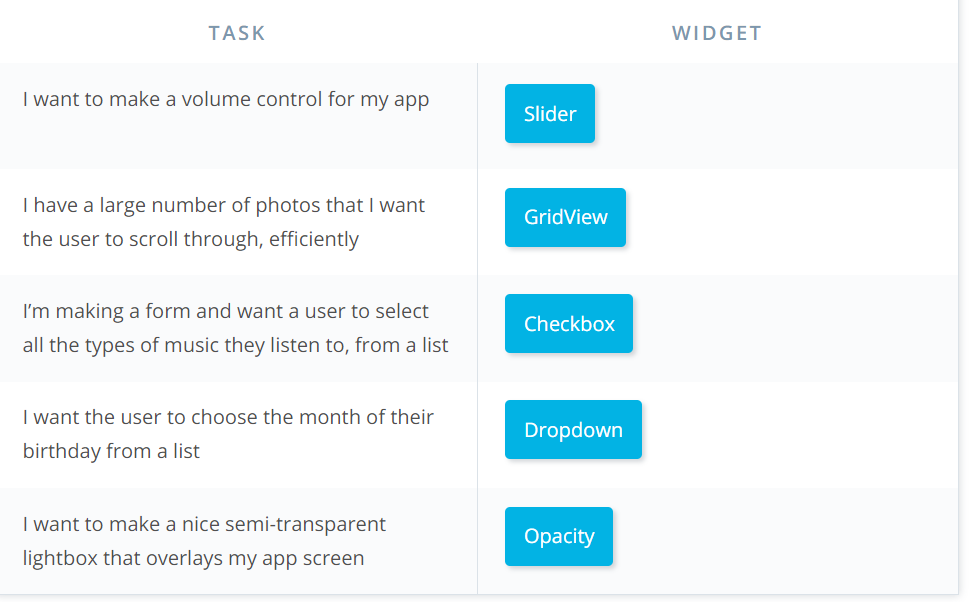
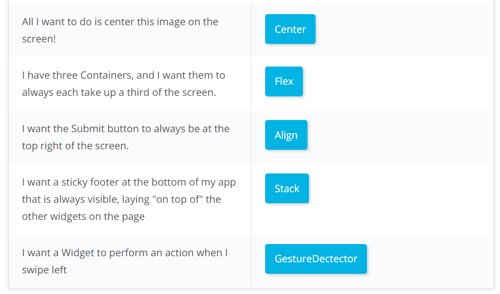

# [Flutter](https://flutter.io)

## Flutter Resources

- [flutter-examples](https://github.com/nisrulz/flutter-examples)
- [examples](https://github.com/flutter/examples)
- [examples](https://github.com/flutter/flutter/tree/master/examples)
- [FluterExampleApps](https://github.com/iampawan/FlutterExampleApps)
- [cookbook](https://flutter.io/cookbook/)
- [Documentatio](https://docs.flutter.io/)
- [Github](https://github.com/flutter/flutter)
- [StackOverflow](https://stackoverflow.com/questions/tagged/flutter)
- [Gitter](https://gitter.im/flutter/flutter)
- [Effective Dart Guide](https://www.dartlang.org/guides/language/effective-dart)
- [Dart Tips](https://www.dartlang.org/resources/dart-tips)
- [Flutter FAQ](https://flutter.io/faq/)
- [Flutter Rendering](https://www.youtube.com/watch?v=UUfXWzp0-DU)
- [Flutter Engine](https://github.com/flutter/engine/wiki)
- [Hot Reload](https://flutter.io/hot-reload/)
- [Flutter Inspector](https://dart-lang.github.io/observatory/)
- [Dart Style Guide](https://www.dartlang.org/guides/language/effective-dart/style)
- [Dart Observatory](https://dart-lang.github.io/observatory/)
- [Flutter Widgets](https://flutter.io/widgets/)
- [Flutter Gallery App Code](https://github.com/flutter/flutter/tree/master/examples/flutter_gallery)
- [Flutter Gallery Android App](https://play.google.com/store/apps/details?id=io.flutter.demo.gallery)
- [Flutter Layout](https://flutter.io/tutorials/layout/)
- [Material](https://material.io)
- [Icons](https://thenounproject.com)
- [Images](https://unsplash.com)
- [Fonts](https://fonts.google.com)
- [Google APIs](https://pub.dartlang.org/packages/googleapis)
- [Async and Futures](https://www.dartlang.org/tutorials/language/futures)
- [Testing](https://flutter.io/testing/)

## What

>Flutter is Google’s mobile app SDK for crafting high-quality native interfaces on iOS and Android in record time. Flutter works with existing code, is used by developers and organizations around the world, and is free and open source.

## Why

1. [Flutter 原理简解](https://juejin.im/entry/5afa9769518825428630a61c) 
1. [Flutter简介](https://blog.csdn.net/hekaiyou/article/details/77875777)

至少两个方面

- 框架自己的渲染引擎，跨平台和效率优势
- dart 强类型语言，比JavaScript更适合复杂应用多人协作

## [How](https://flutter.io/setup-windows/#system-requirements)

- SDK
- CLI
- IDE

- [Documentation](https://docs.flutetr.io/)
- [Github](https://github.com/flutter/flutter)
- [StackOverflow](https://stackoverflow.com/questions/tagged/flutter)
- [Gitter](https://gitter.im/flutter/flutter)

- flutter doctor :
- Android toolchain:Android SDK

- [widgets](https://flutter.io/docs/development/ui/widgets)
- 
- 

### 基本概念

widgets:是描述Element的数据、配置数据
Element：最终用于绘制UI元素的类

- **build是什么？**

- Navigator route
组合widget是=》route 可以理解为一个页面，可以切换，等同page
组合的原则是划分快

### 

借鉴了React 组件化和State的思想

- Stateless widgets are immutable, meaning that their properties can’t change—all values are final.
- Stateful widgets maintain state that might change during the lifetime of the widget. 

## [Dart](https://www.dartlang.org)

### [Dart中的异步操作](https://mp.weixin.qq.com/s?__biz=MjM5MzkxNDg2OQ==&mid=2649872970&idx=1&sn=e63d778eabd758e3eb34c1c01dad4116&chksm=be8ab0d089fd39c60426516a0ef18a70d53537f479da3d1d6c14a582b87233acbcc78c6c4b02&mpshare=1&scene=1&srcid=0712RlR42xdcLvWuSyP33iAx#rd) 

[tutorials futurs](https://www.dartlang.org/tutorials/language/futurs)

1. Dart是单线程的编程语言
1. 使用Future可以是同步操作异步化
1. Future可以使用async和await来回去
1. Future可以处理链式调用和多个Future同时返回结果

单线程 防阻塞 需要异步=> Future，我说是Promise Async await 就容易理解了。

同名 构造函数
 _下划线私有变量
 const final的区别

```dart
Future<String>  waitDinnerFuture = new Future(waitForDinner);

waitDinnerFuture.then((str){});接收上层返回可用的值
waitDinnerFuture.whenComplete((){});事件完成回调
waitDinnerFuture.catchError((error){});事件错误的捕获
waitDinnerFuture.timeout(new Duration(microseconds: 30));超时时间
```

```dart
// Sequential processing using async and await.
main() async {
  await expensiveA();
  await expensiveB();
  doSomethingWith(await expensiveC());
}
```

### [Flutter中的本地存储](https://mp.weixin.qq.com/s?__biz=MjM5MzkxNDg2OQ==&mid=2649872974&idx=1&sn=edba3c27df1601cea770b396c0eaeb4e&chksm=be8ab0d489fd39c2db0ef983aef0f5931f775c04bbf5e917885ce66b98101af05670ccff14e8&mpshare=1&scene=1&srcid=0712jhme4PctFabOdmRER8AO#rd)

## 起步

- 入口文件：`lib/main.dart`

`import 'package:flutter/material.dart';`

`jar` 包位于 `flutter\bin\cache\artifacts\engine`

## 引入包

[pub.dev] (https://pub.dev/flutter/packages)

1. pubspec
1. flutter packages get

## Using the Flutter inspector

[调试工具](https://flutter.dev/docs/development/tools/devtools/inspector)

## plugin

cached_network_image
http 
json_serializable
built_value
Map<String,dynamic> app = JSON.decode(jsonresponsebody)
map['key'
]json_to_dart
shared_preferences