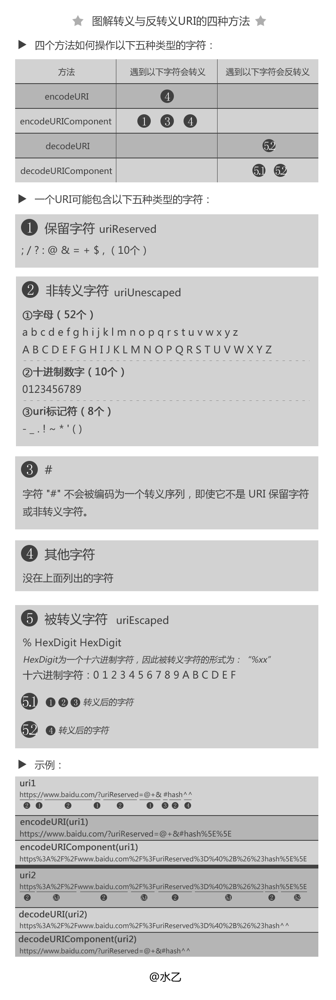
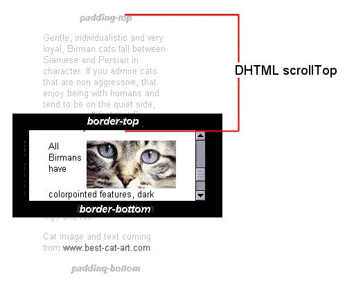
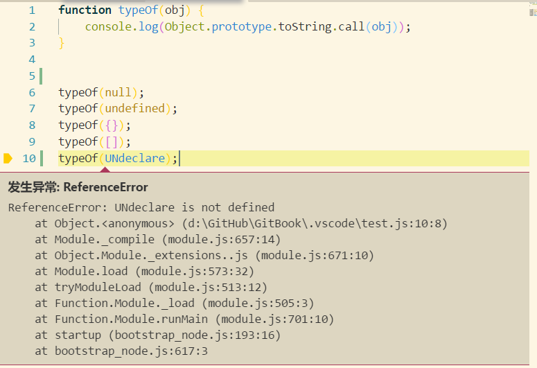

# JavaScript

>**参考书目** 《JavaScript权威指南》
>[《ECMAScript 6 入门》](http://es6.ruanyifeng.com/)
>[es2015](https://babeljs.io/learn-es2015/)
>[19 个常用的 JavaScript 简写方法](https://mp.weixin.qq.com/s?__biz=MzAwNDcyNjI3OA==&mid=2650840838&idx=1&sn=5b8d653fa8b0e1e7d1dc630e844cd2f0&chksm=80d3b46fb7a43d79086e77ce1f4e85d0d110b5426d8af6e942c96d3c5030fde738fde6725879&scene=0#rd)

[ES6展开运算符的6种妙用](https://www.jianshu.com/p/c5230c11781b)

## 数据类型

### [Blob](https://developer.mozilla.org/zh-CN/docs/Web/API/Blob)

- [前端js保存页面为图片下载到本地的坑](caibaojian.com/h5-download.html)
- [使用 JavaScript 创建并下载文件](http://caibaojian.com/js-download.html)

```js
let title = document.getElementById('title');
let tr = document.getElementById('tr');
let downloadBtn = document.getElementById('download');

downloadBtn.onclick = () => {
  let content = `${title.innerHTML},${tr.innerHTML}`;
  let blob =new Blob([content],{type: "text/plain" });
  let url  = URL.createObjectURL(blob);
  downloadBtn.href = url;
  downloadBtn.download = '1.txt'
}
downloadBtn.click()

```

### ECMAScript 6定义了7种数据类型

>[JavaScript数据类型和数据结构](https://developer.mozilla.org/zh-CN/docs/Web/JavaScript/Data_structures)

### 原始类型（值本身无法被改变）（primitive value）

- boolean：0、nan、undefined、null、""表示false，否则是true
- null：未初始化的object
- undefined：未初始化的原始类型
- number：0八位、0x十六位
  - NaN `NaN !==NaN :` true
- string：
- Symbol（ECMAScript 6）

[JS数字精度丢失的一些典型问题](http://www.cnblogs.com/snandy/p/4943138.html)

类型 | true|false
---|---|---
Boolean | true | false
Null | \ | null
Undefined | \ | undefined
Number | \ | 0、NaN
String |  \| ""

```js
console.log(Object.prototype.toString.call(true));//[object Boolean]
console.log(Object.prototype.toString.call("String"));//[object String]
console.log(Object.prototype.toString.call(0x0098098));//[object Number]
console.log(Object.prototype.toString.call(undefined));//[object Undefined]
console.log(Object.prototype.toString.call(null));//[object Null]

```

### Object

[内置对象](https://developer.mozilla.org/zh-CN/docs/Web/JavaScript/Reference/Global_Objects)

- Number
  - parseInt(string):参数的进制
  - parseFloat(string)
- [String](https://developer.mozilla.org/zh-CN/docs/Web/JavaScript/Reference/Global_Objects/String)
  - toString()
  - String()
  - [str.charAt(index)](https://developer.mozilla.org/zh-CN/docs/Web/JavaScript/Reference/Global_Objects/String/charAt)
  - [str.charCodeAt(index)](https://developer.mozilla.org/zh-CN/docs/Web/JavaScript/Reference/Global_Objects/String/charCodeAt)
  - [String.fromCharCode(num1, ..., numN)](https://developer.mozilla.org/zh-CN/docs/Web/JavaScript/Reference/Global_Objects/String/fromCharCode) **String类方法**
  - [str.indexOf(searchValue[, fromIndex])](https://developer.mozilla.org/zh-CN/docs/Web/JavaScript/Reference/Global_Objects/String/indexOf)
  - [str.match(regexp)](https://developer.mozilla.org/zh-CN/docs/Web/JavaScript/Reference/Global_Objects/String/match)
  - [str.split([separator[, limit]])](https://developer.mozilla.org/zh-CN/docs/Web/JavaScript/Reference/Global_Objects/String/split)
  - [str.replace(regexp|substr, newSubStr|function)](https://developer.mozilla.org/zh-CN/docs/Web/JavaScript/Reference/Global_Objects/String/replace)
  - [str.substr(;ustart[, length])](https://developer.mozilla.org/zh-CN/docs/Web/JavaScript/Reference/Global_Objects/String/substr)
  - [str.substr(start[, length])](https://developer.mozilla.org/zh-CN/docs/Web/JavaScript/Reference/Global_Objects/String/substr)
  - [str.substring(indexStart[, indexEnd])](https://developer.mozilla.org/zh-CN/docs/Web/JavaScript/Reference/Global_Objects/String/substring)
  - [str.toLowerCase()](https://developer.mozilla.org/zh-CN/docs/Web/JavaScript/Reference/Global_Objects/String/toLowerCase): 会将调用该方法的字符串值转为小写形式，并返回。toLowerCase 不会影响字符串本身的值。
  - [str.toUpperCase()](https://developer.mozilla.org/zh-CN/docs/Web/JavaScript/Reference/Global_Objects/String/toUpperCase): 将调用该方法的字符串值转换为大写形式，并返回。toUpperCase 方法不影响字符串本身的值。
  - [str.trim()](https://developer.mozilla.org/zh-CN/docs/Web/JavaScript/Reference/Global_Objects/String/Trim): 方法并不影响原字符串本身，它返回的是一个新的字符串。
  - [str.slice(beginSlice[, endSlice])](https://developer.mozilla.org/zh-CN/docs/Web/JavaScript/Reference/Global_Objects/String/slice)
- [Array](https://developer.mozilla.org/zh-CN/docs/Web/JavaScript/Reference/Global_Objects/Array)
  - [indexOf()](https://developer.mozilla.org/zh-CN/docs/Web/JavaScript/Reference/Global_Objects/Array/indexOf)
  - [push()](https://developer.mozilla.org/zh-CN/docs/Web/JavaScript/Reference/Global_Objects/Array/push)
  - [pop()](https://developer.mozilla.org/zh-CN/docs/Web/JavaScript/Reference/Global_Objects/Array/pop)
  - [shift()](https://developer.mozilla.org/zh-CN/docs/Web/JavaScript/Reference/Global_Objects/Array/shift)
  - [unshift()](https://developer.mozilla.org/zh-CN/docs/Web/JavaScript/Reference/Global_Objects/Array/unshift)
  - [sort()](https://developer.mozilla.org/zh-CN/docs/Web/JavaScript/Reference/Global_Objects/Array/sort)
  - [reverse()](https://developer.mozilla.org/zh-CN/docs/Web/JavaScript/Reference/Global_Objects/Array/reverse)
  - [find()](https://developer.mozilla.org/zh-CN/docs/Web/JavaScript/Reference/Global_Objects/Array/find)
  - [every()](https://developer.mozilla.org/zh-CN/docs/Web/JavaScript/Reference/Global_Objects/Array/every)
  - [some()](https://developer.mozilla.org/zh-CN/docs/Web/JavaScript/Reference/Global_Objects/Array/some)
  - [filter()](https://developer.mozilla.org/zh-CN/docs/Web/JavaScript/Reference/Global_Objects/Array/filter)**原始数组不会被修改**
  - [join()](https://developer.mozilla.org/zh-CN/docs/Web/JavaScript/Reference/Global_Objects/Array/join)**原始数组不会被修改**
  - [slice()](https://developer.mozilla.org/zh-CN/docs/Web/JavaScript/Reference/Global_Objects/Array/slice)**原始数组不会被修改**
  - [forEach()](https://developer.mozilla.org/zh-CN/docs/Web/JavaScript/Reference/Global_Objects/Array/forEach)
    - 如果数组在迭代时被修改了，则其他元素会被跳过。
    - forEach() 总是返回 undefined值,为每个数组元素执行callback函数；
  - [map()](https://developer.mozilla.org/zh-CN/docs/Web/JavaScript/Reference/Global_Objects/Array/map)**原始数组不会被修改**
  - [reduce()](https://developer.mozilla.org/zh-CN/docs/Web/JavaScript/Reference/Global_Objects/Array/reduce)**原始数组不会被修改**
- [Math](https://developer.mozilla.org/zh-CN/docs/Web/JavaScript/Reference/Global_Objects/Math)
  - [Math.max(x)](https://developer.mozilla.org/zh-CN/docs/Web/JavaScript/Reference/Global_Objects/Math/max)
  - [Math.min(x)](https://developer.mozilla.org/zh-CN/docs/Web/JavaScript/Reference/Global_Objects/Math/min)
  - [Math.floor(x)](https://developer.mozilla.org/zh-CN/docs/Web/JavaScript/Reference/Global_Objects/Math/floor): 返回小于或等于一个给定数字的最大整数。**向下取整**
  - [Math.ceil(x)](https://developer.mozilla.org/zh-CN/docs/Web/JavaScript/Reference/Global_Objects/Math/ceil): 函数返回大于或等于一个给定数字的最小整数。**向上取整**
  - [Math.abs(x)](https://developer.mozilla.org/zh-CN/docs/Web/JavaScript/Reference/Global_Objects/Math/abs): 绝对值
  - [Math.round(x)](https://developer.mozilla.org/zh-CN/docs/Web/JavaScript/Reference/Global_Objects/Math/round): 函数返回一个数字四舍五入后最接近的整数。
  - [Math.random(x)](https://developer.mozilla.org/zh-CN/docs/Web/JavaScript/Reference/Global_Objects/Math/round): 
    - 得到一个两数之间的随机数：
    ```js
    function getRandomArbitrary(min, max) {
        return Math.random() * (max - min) + min;
    }
    ```
    - 得到一个两数之间的随机整数：
    ```js
    function getRandomInt(min, max) {
        min = Math.ceil(min);
        max = Math.floor(max);
        return Math.floor(Math.random() * (max - min)) + min; //The maximum is exclusive and the minimum is inclusive
    }
    ```
    - 得到一个两数之间的随机整数，包括两个数在内：
    ```js
    function getRandomIntInclusive(min, max) {
        min = Math.ceil(min);
        max = Math.floor(max);
        return Math.floor(Math.random() * (max - min + 1)) + min; //The maximum is inclusive and the minimum is inclusive 
    }
    ```
- [RegExp](https://developer.mozilla.org/zh-CN/docs/Web/JavaScript/Reference/Global_Objects/RegExp)
- [Date](https://developer.mozilla.org/zh-CN/docs/Web/JavaScript/Reference/Global_Objects/Date)
  - new Date():当前日期|毫秒数|年月日时分秒
  - [getFullYear()](https://developer.mozilla.org/zh-CN/docs/Web/JavaScript/Reference/Global_Objects/Date/getFullYear)
  - [getMonth()](https://developer.mozilla.org/zh-CN/docs/Web/JavaScript/Reference/Global_Objects/Date/getMonth)
  - [getDate()](https://developer.mozilla.org/zh-CN/docs/Web/JavaScript/Reference/Global_Objects/Date/getDate)
  - [getDay()](https://developer.mozilla.org/zh-CN/docs/Web/JavaScript/Reference/Global_Objects/Date/getDay)
  - [getHours()](https://developer.mozilla.org/zh-CN/docs/Web/JavaScript/Reference/Global_Objects/Date/getHours)根据本地时间，返回一个指定的日期对象的小时。返回一个0 到 23之间的整数值。
  - [getMinutes()](https://developer.mozilla.org/zh-CN/docs/Web/JavaScript/Reference/Global_Objects/Date/getMinutes)
  - [getSeconds()](https://developer.mozilla.org/zh-CN/docs/Web/JavaScript/Reference/Global_Objects/Date/getSeconds)
  - [getTime()](https://developer.mozilla.org/zh-CN/docs/Web/JavaScript/Reference/Global_Objects/Date/getTime)

## 表达式和运算符

>[表达式和运算符](https://juejin.im/post/58116ca467f3560057d58bee)
>[JavaScript 需要句末加";"吗？](https://www.zhihu.com/question/20298345)

### 表达式

- 原始表达式：常量、变量、保留字。
- 对象、数组初始化表达式：`var obj={a:1,b:2};`
- 函数定义表达式：`var fn=function(){}`
- 属性访问表达式：`Bruce.firstName`
- 调用表达式：`alert('hello');`
- 对象创建表达式：`new object();`

### 运算符

#### 算数

`+ - * / %`

#### 逻辑

与或非 短路 返回的值是否Boolean

##### $$ and ||

```js
$("#btshow").click(function (e) {
    /*
    《JavaScript权威指南》p80：
        &&短路运算符 和||返回的是变量本身，但是因为JavaScript可以自动转换Boolean值，所以常用来判断真假值。
        A && B 
        - if A=false => A, =>C
        - if A=true => B,{
                        - if B = true => B
                        - if B = false => C 
                        }
    */
    var isA = !!($._data);
    var isB = !!($._data($(document)[0], "events"));
    var isC = !!($.data($(document)[0], "events"));

    var _arr_events = $._data && $._data($(document)[0], "events.data($(document)[0], "events")';
    for (key in _arr_events) {
        show(key + "事件数量：" + _arr_events[key].length);
    }
})
```

#### 比较

大于小于等不等

#### 三元

`?:`

#### 赋值

LHS RHS

[关于连续赋值的坑](https://www.zhihu.com/question/41220520)
[JavaScript 连等赋值问题](https://segmentfault.com/q/1010000002637728)

[JavaScript中的逗号运算符](https://www.cnblogs.com/sun-mile-rain/p/4037916.html)

### 解构赋值

>[概念：XOR_swap](https://en.wikipedia.org/wiki/XOR_swap)

- 表明原变量的类型，属性名字、顺序要一致
- 取数赋值跟交换是两种用途：`[a,b] = [b,a]`此为交换

### 语句

- 条件
- 分支
- [循环](https://developer.mozilla.org/zh-CN/docs/Web/JavaScript/Guide/Loops_and_iteration)
  - for 语句
  - do...while 语句
  - while 语句
  - labeled 语句
  - break 语句
  - continue 语句
  - for...in 语句 *需要再学习一下，注意区别（挖坑）
  - for...of 语句 *
  - [for of和for in的区别](https://segmentfault.com/q/1010000006658882)

  continue label break

`for...in`针对的是普通对象，

- key是字符串而不是数字
- 会遍历自有属性，顺着原型链
- 可能是随机的而不是按照所谓Array的方式

`for...of`更适合遍历数组
for...in 循环遍历的结果是数组**元素的下标**， for...of 遍历的结果是**元素的值**：

```js
let arr = [3, 5, 7];
arr["3"] = "third"
arr["fourth"] = "fourth"

for (let i in arr) {
   console.log(i); // 0 1 2 3 fourth
}

for (let i of arr) {
   console.log(i); // 3 5 7 third
}
```

### 变量

#### 变量作用域

变量提升，函数优先

[变量用var和不用var的区别](https://segmentfault.com/a/1190000000638445)

[ES6 变量作用域与提升：变量的生命周期详解](https://segmentfault.com/a/1190000010640225)

 ---

1. 不用var是全局变量的属性；可以用delete删除【属性】；不能变量提升
1. 用var是变量；不可以用delete删除；会变量提升；是局部变量。
1. 每个变量下都有一个隐藏属性，configurable,这个属性确定了变量名字能否更改，变量能否被删除。true的话，可以更改，可删除；反之，不能更改，不能删除。 
1. 在用var 声明变量时，JS解析器会默认把configurable设为false，所以它不能改名字，不能被删掉。

1. `'use strict'`模式下不使用var会报错。

一个变量的作用域是程序源代码中定义这个变量的区域。全局变量和局部变量
这里涉及函数优先：函数表达式优先于var变量被提升。
关于变量提升还有函数提升：使用定义式则是赋值也提升了，如果使用表达式就如同使用var的变量一样，只是声明提升了而没有赋值，是undefined。

```js
    a();//函数提升
    console.log(a);//[Function: a]
    var a = "变量已赋值";
    console.log(a);//变量已赋值
    function a(){
        console.log("函数提升");
    }
    a = 3;
    console.log(a);//3
    a();//报错：a is not a function
```

### let的[用法](https://developer.mozilla.org/zh-CN/docs/Web/JavaScript/Reference/Statements/let)

 新增的块级作用域。

```js
function varTest() {
    var x = 1;
    if (true) {
        var x = 2;  // 同样的变量!
        console.log(x);  // 2
    }
    console.log(x);  // 2
}

function letTest() {
    let x = 1;
    if (true) {
        let x = 2;  // 不同的变量
        console.log(x);  // 2
    }
    console.log(x);  // 1
}
```

## 对象

[对象初始化](https://developer.mozilla.org/zh-CN/docs/Web/JavaScript/Reference/Operators/Object_initializer)

## 属性

[Object.defineProperty()](https://developer.mozilla.org/zh-CN/docs/Web/JavaScript/Reference/Global_Objects/Object/defineProperty)

## ES6 计算属性名语法

```js
    let a = "top", b = "24%", c;
    c = { a: b };
    console.log("{a: b}", c); // {a:b} {a: "24%"}
    c = { [a]: b }; // {[a]:b} {top: "24%"}
```

### 对象的创建

- 字面量:不会调用Object构造函数
- new
- Object.create()：涉及原型

Delete 属性
原型对象、类和继承
原型是一个实例对象。
对象
JavaScript秘密花园

hasOwnProperty判断自有属性

猴子补丁：
这个叫法起源于Zope框架，大家在修正Zope的Bug的时候经常在程序后面追加更新部分，这些被称作是“杂牌军补丁(guerilla patch)”，后来guerilla就渐渐的写成了gorllia((猩猩)，再后来就写了monkey(猴子)，所以猴子补丁的叫法是这么莫名其妙的得来的。
猴子补丁主要有以下几个用处：

1. 在运行时替换方法、属性等
2. 在不修改第三方代码的情况下增加原来不支持的功能
3. 在运行时为内存中的对象增加patch而不是在磁盘的源代码中增加

原型和原型的好处：

### 数组(Array)

初始化：
```js
new Array(length)
new Array(obj,obj,obj)
[obj,obj,obj]
[...Array(100)].map(_=>0);
```

new Object Array String Number Boolean 返回的是相应的对象


#### 数组方法

 map forEach 的区别 有么有返回值、返回的是什么（有一个术语，描述function是否改变自身array，忘了是什么了......)

[Js 数组——filter()、map()、some()、every()、forEach()、lastIndexOf()、indexOf()](https://www.cnblogs.com/xiao-hong/p/3194027.html)
[JavaScript数组所有API全解密](http://louiszhai.github.io/2017/04/28/array/?from=timeline)
[【深度长文】JavaScript数组所有API全解密](http://louiszhai.githnub.io/2017/04/28/array/?from=timeline)
[array 方法](http://louiszhai.github.io/2017/04/28/array/#some)

- 改变自身
- 不改变自身
- 遍历

判断是否是数组的方法是看类属性（是对象的三个属性之一：原型、类、可扩展）

```js
//对象&&对象类型
function isArray(obj) {
    return Array.isArray(function (obj) {
        return typeof obj === "object" && Array.prototype.toString.call(obj) === "[object Array]";
    };
}
```

### set

唯一性

NaN等于自身，而精确相等运算符认为NaN不等于自身`NaN !==NaN`为true。

### 函数(function)

#### 箭头函数Arrow_functions

[Arrow_functions](https://developer.mozilla.org/zh-CN/docs/Web/JavaScript/Reference/Functions/Arrow_functions)

可以被定义，可以被调用，是一种语法，也是一种值，可以被程序操作，可以作为函数的参数。
Arrow_functions no this or arguments、super、new.target。call apply 因为没有this ，无法改变Arrow里面的this指向。

```js
(function() {
  console.log(this);
  return [
    (() => {
      console.log(this.x);
    }).bind({ x: 'inner' })()
  ];
}).call({ x: 'outer' });
// { x: 'outer' }
// 因为Arrow——function没有this所以bind是无效的，=》无法改变Arrow里面的this指向
// outer
```

#### 自执行匿名函数（Self-executing anonymous function）/立即调用的函数表达式（Immediately-Invoked Function Expression）

[JavaScript匿名函数与自执行](http://www.jcodecraeer.com/a/jquery_js_ajaxjishu/2012/0628/290.html)

- 匿名函数的作用创建闭包和减少全局变量（防止污染命名空间）
[深入理解JavaScript系列（4）：立即调用的函数表达式。](http://www.cnblogs.com/TomXu/archive/2011/12/31/2289423.html)

- 表达式和function声明，表达式是一个引用，没有立即执行。
- 让一个函数声明语句变成了一个表达式。
- 任何消除函数声明和函数表达式间歧义的方法，都可以被解析器正确识别
- 一元运算都是有效的

[运算符性能测试](https://jsperf.com/js-funcion-expression-speed)

```js
(function(){/*code*/})();//****推荐，因为性能
!function(){/*code*/}();
+function(){/*code*/}();
```

#### prototype 和__proto__的区别是什么？

> Mozilla’s implementation of JavaScript has (since the early days of Netscape) exposed the prototype attribute through the specially named __proto__ property, and you can use this property to directly query or set the prototype of any object. Using __proto__ Core JavaScript is not portable: it has not been (and probably never will be) implemented by IE or Opera, although it is currently supported by Safari and Chrome. Versions of Firefox that implement ECMAScript 5 still support __proto__, but restrict its ability to change the prototype of nonextensible objects.

constructor function有prototype，使用new 关键字返回的实例对象有__proto__：

```js
//(错误Code表示)
object[__proto__] = new Constructor[prototype]
```

指向的是同一个对象，**但是**不建议直接使用object的__proto__来修改constructor function的prototype。

```js
        // 有一堆原材料就是自有变量
        var Calculator = function (decimalDigits, tax) {
            this.decimalDigits = decimalDigits;
            this.tax = tax;
        };
        // 交给谁来处理是可以切换的
        var one = {
            describe: function () {
                return console.log("original describe");
            },
            add: function (x, y) {
                return console.log(x + y);
            },
            subtract: function (x, y) {
                return console.log(x - y);
            }
        };
        var two = {
            describe: function () {
                return console.log("original describe");
            }, multiply: function (x, y) {
                return console.log(x * y);
            },
            divide: function (x, y) {
                return console.log(x / y);
            }
        };
        Calculator.prototype = one;
        var oneCalculator = new Calculator();
        oneCalculator.add(1, 2);
        oneCalculator.subtract(1, 2);
        // or
        Calculator.prototype = two;
        var twoCalculator = new Calculator();
        twoCalculator.multiply(1, 2);
        twoCalculator.divide(1, 2);

        twoCalculator.__proto__.describe = function () {
            return console.log("describe has changed");
        }
        // 实例对象有__proto__属性；
        console.log(Calculator.prototype===twoCalculator.__proto__);
        one.describe();
        two.describe();
        //改变的是原型所以two和three都被改变
        var three = new Calculator();
        three.describe();
        //改变的只是three的describe
        three.describe = function () {
            return console.log("three describe has changed");
        };
        //所以four不变
        var four = new Calculator();
        three.describe();
        four.describe();
        //使用new不会重新生成原型上的实例
```

### this

使用准则：

1. 作为函数调用this指代全局对象（^strict）或者undefined（strict）；

1. 作为方法调用指代调用的对象本身；
1. 作为构造函数this指代构造对象本身，跟2的方式不同。即`new object.constructor()`中的`this`（调用上下文）并不是object而是constructor()返回的对象；
1. 作为间接调用call()、apply()，显示指定this。另外也可以理解成上面的三种是第四种的语法糖，因为都可以用第四种表示出来而且没有异议。

---
>《你不知道的JavaScript（上卷）》

- `this` 默认绑定 同上1
- 隐式绑定
- 显示绑定

判断this
现在我们可以根据优先级来判断函数在某个调用位置应用的是哪条规则。可以按照下面的顺序来进行判断：

1. 函数是否在new 中调用（new 绑定）？如果是的话this 绑定的是新创建的对象。`var bar = new foo()`

1. 函数是否通过call、apply（显式绑定）或者硬绑定调用？如果是的话，this 绑定的是指定的对象。 `var bar = foo.call(obj2)`
1. 函数是否在某个上下文对象中调用（隐式绑定）？如果是的话，this 绑定的是那个上下文对象。 `var bar = obj1.foo()`
1. 如果都不是的话，使用默认绑定。如果在严格模式下，就绑定到undefined，否则绑定到全局对象。`var bar = foo()` 这个特性倒是可以用来区别当前是否是strict模式： `var isStrict = (function(){return !this})();`

```JS
    function f(argument) {
        console.log(this);
    }

    var ar = [f,f];
    ar[0]();
    ar[0].call(ar);
    var obj = {a:"obj"};
    obj.f = f;
    obj.f();
    obj.f.call(obj);
```

### 可变参数和默认值

JavaScript目前没有对参数类型进行检查，实参与形参可能不相符，TypeScript用于解决这样的问题。
> 现在,JavaScript已经不仅仅是当年只用来验证表单的玩具，而成为一门真正的适用性广泛的语言来完成复杂度较高的应用。静态语言编译时校验的价值就在工程实践中凸显出来，TypeScript适时而起。--woshuode

### 可变参数**arguments**

[arguments](https://developer.mozilla.org/zh-CN/docs/Web/JavaScript/Reference/Functions/arguments) 是**类数组**对象，以数字作为key。通过以下方法转换为真·数组：
主要是使用

```js
let args = Array.prototype.slice.call(arguments); 
or
let args = Array.from(arguments);
let args = [...arguments];
```

ES6的新方法

```js
            function containsAll(haystack, ...needles) {
                for (let needle of needles) {
                    if (haystack.indexOf(needle) === -1) {
                        return false;
                    }
                } return true;
            }
```

以下是不推荐使用的arguments方法：
>[callee()](https://developer.mozilla.org/zh-CN/docs/Web/JavaScript/Reference/Functions/arguments/callee)
- `arguments.callee()`：当前执行的函数。匿名函数指代自身：递归**factorial**
- `arguments.caller()`：调用当前函数的函数（栈）**This feature is obsolete**。 

### 默认值

防止undefined或者null（未初始化）：

```js
a = b| "";
```

ES6的新方法：

```js
function animalSentence(animals2 = "tigers", animals3 = "bears") {
                return `Lions and ${animals2} and ${animals3}! Oh my!`;
            }
```

### 将对象作为实参

好处是不用记得顺序，坏处是要记得形参的名字

### 闭包Closure

>[闭包和私有变量](https://www.404forest.com/2015/03/21/JS%E8%87%AA%E6%88%91%E6%A2%B3%E7%90%86%EF%BC%9A%E9%97%AD%E5%8C%85%E3%80%81%E7%A7%81%E6%9C%89%E5%8F%98%E9%87%8F/)
闭包？
继承？
原型？

**Lexical scoping 词法作用域**
函数定义时就决定了变量作用域，而不是在函数调用时。
参数和局部变量，嵌套的，全局变量

```js
var scope = "global scope";//全局变量
function checkscope() {
    var scope = "local scope";//局部变量
    function f() { return scope; }//在作用域中返回这个值
    return f;
}
checkscope()()//返回值是什么?
```

常常出现的错误在于，for循环中保存通过var声明的counter值，因为共享的是同一个counter，所以保存的是循环的最后一个值。
而使用块级作用域声明let或者使用闭包可以保存每一个counter值：

```js
function constfunc(v) {return function () {return v; } }
```

这里有两个`function`，两个`return`，ES 6 中的`let`尝试的块级作用域用具解决闭包的繁琐。

变量作用域
>作用域链《JavaScript权威指南》3.10.3
JavaScript是基于词法作用域的语言：通过阅读包含变量定义在内的数行源码就能知道变量的作用域。全局变量在程序中始终都是有定义的。局部变量在声明它的函数体内以及其所嵌套的函数内始终是有定义的。
 如果将一个局部变量看做是自定义实现的对象的属性的话，那么可以换个角度来解读变量作用域。每一段JavaScript代码（全局代码或函数）都有一个与之关联的作用域链（scope chain）。这个作用域链是一个对象列表或者链表，这组对象定义了这段代码“作用域中”的变量。当JavaScript需要查找变量x的值的时候（这个过程称做“变量解析”（variable resolution）），它会从链中的第一个对象开始查找，如果这个对象有一个名为x的属性，则会直接使用这个属性的值，如果第一个对象中不存在名为x的属性，JavaScript会继续查找链上的下一个对象。如果第二个对象依然没有名为x的属性，则会继续查找下一个对象，以此类推。如果作用域链上没有任何一个对象含有属性x，那么就认为这段代码的作用域链上不存在x，并最终抛出一个引用错误（ReferenceError）异常。
 在JavaScript的最顶层代码中（也就是不包含在任何函数定义内的代码），作用域链由一个全局对象组成。在不包含嵌套的函数体内，作用域链上有两个对象，第一个是定义函数参数和局部变量的对象，第二个是全局对象。在一个嵌套的函数体内，作用域链上至少有三个对象。理解对象链的创建规则是非常重要的。当定义一个函数时，它实际上保存一个作用域链。当调用这个函数时，它创建一个新的对象来存储它的局部变量，并将这个对象添加至保存的那个作用域链上，同时创建一个新的更长的表示函数调用作用域的“链”。对于嵌套函数来讲，事情变得更加有趣，每次调用外部函数时，内部函数又会重新定义一遍。因为每次调用外部函数的时候，作用域链都是不同的。内部函数在每次定义的时候都有微妙的差别——在每次调用外部函数时，内部函数的代码都是相同的，而且关联这段代码的作用域链也不相同。

## 泛函数

>这里借用数学的概念，简单来说，泛函就是定义域是一个函数，而值域是一个函数，推广开来， 泛函就是从任意的向量空间到标量的映射。 泛函也是一种“函数”，它的独立变量一般不是通常函数的“自变量”，而是通常函数本身。泛函是函数的函数。 泛函的英文是 Functional， 所以也可以把函数式编程(Functional Programming)称为泛函编程（对应在函数式编程中也把泛函称为高阶函数(higher-order function) (HOF)的）。

### 可调用对象

>《JavaScript权威指南》8.7.7

函数都可以被调用，但是被调用的不都是函数，也有可能是可调用对象。例如客户端方法：`Window.alert() `和 `Document.getElementById();`是为可调用的宿主对象。但是快被废弃了，所以没什么强调的必要。

### Function()构造函数

注意new Function(arg[,arg[,…]],body)构造函数的函数体代码的编译总是会在顶层函数执行，也就是全局作用域。

### call() 、apply() 和bind() 

[call](https://developer.mozilla.org/en-US/docs/Web/JavaScript/Reference/Global_Objects/Function/call)和apply是用来**动态改变this。**（函数运行时的context，也就是上下文即this的指向）而[bind()](https://developer.mozilla.org/zh-CN/docs/Web/JavaScript/Reference/Global_Objects/Function/bind)是利用apply/call来返回一个函数，用来**永久实现**以上功能。（apply/call的使用是一次性调用的，而bind是返回一个新函数）
>The bind() method creates a new function that, when called, has its this keyword set to the provided value, with a given sequence of arguments preceding any provided when the new function is called.

```js
if (!Function.prototype.bind) {
    Function.prototype.bind = function (obj,/*,args*/) {
        var self = this, boundArgs = arguments;
        return function () {
            var args = [], i;
            for (i = 1; i < boundArgs.length; i++)args.push(boundArgs[i]);
            for (i = 0; i < arguments.length; i++)args.push(arguments[i]);
            return self.apply(o, args);
        }
    }
}

this.x = 9;
var module = {
    x: 81,
    getX: function () { return this.x; }
};

module.getX(); // 返回 81

var retrieveX = module.getX;
retrieveX(); // 返回 9, 在这种情况下，"this"指向全局作用域
// 创建一个新函数，将"this"绑定到module对象
// 新手可能会被全局的x变量和module里的属性x所迷惑
var boundGetX = retrieveX.bind({ x: 33 });
console.log(boundGetX()); // 返回 33

```

strict模式中 call() 和 apply()的第一个值是this，其他的情况null和undefined是全局对象，或者包装对象（wrapper object）。

[创建绑定函数](https://developer.mozilla.org/zh-CN/docs/Web/JavaScript/Reference/Global_Objects/Function/bind)

bind() 最简单的用法是创建一个函数，使这个函数不论怎么调用都有同样的 this 值。JavaScript新手经常犯的一个错误是将一个方法从对象中拿出来，然后再调用，希望方法中的 this 是原来的对象。（比如在回调中传入这个方法。）如果不做特殊处理的话，一般会丢失原来的对象。从原来的函数和原来的对象创建一个绑定函数，则能很漂亮地解决这个问题：

## Promise

[MDN Promise](https://developer.mozilla.org/zh-CN/docs/Web/JavaScript/Reference/Global_Objects/Promise#%E6%B5%8F%E8%A7%88%E5%99%A8%E5%85%BC%E5%AE%B9%E6%80%A7)

[Promise 解析](https://segmentfault.com/a/1190000000586666)

[ES6 Promise 用法](https://juejin.im/entry/5a3a113a51882569707821c0?utm_medium=fe&utm_source=weixinqun)

[在Node.js中使用promise摆脱回调金字塔](http://nya.io/Node-js/promise-in-nodejs-get-rid-of-callback-hell/)
[q](http://documentup.com/kriskowal/q/)

## What

## Why

## How

- resolve
- reject
- all
- race
- then
- catch

jQuery 主要是用 Deferred对象，与Promise A+标准不同。

```js
    var Q = require('q');
    //1.写一个读取文件的方法，将它封装成promise
    function fs_readFile(file, encoding) {
        var deferred = Q.defer();
        fs.readFile(file, encoding, function (err, data) {
            if (err) deferred.reject(err);
            else deferred.resolve(data);
        })
        return deferred.promise;
    }
    //2.写一个写入文件方法，将它封装成promise
    function fs_writeFile(data, file, encoding) {
        var deferred = Q.defer();
        fs.writeFile(file, data, encoding, function (err) {
            if (err) deferred.reject(err);
            else deferred.resolve('ok');
        })
        return deferred.promise;
    }
    //3.实现逻辑
    fs_readFile('./1.txt', 'utf-8')
        .then(function (data) {return fs_writeFile(data + 'test', './1.txt', 'utf-8')})
        .then(function(){return fs_readFile('./1.txt', 'utf-8')})
        .then(console.log,console.error);
```

1. Promise是什么？有什么作用？适用于哪些场景？如何使用？原理是什么？

## 客户端存储技术

cookie和session的区别
提醒用户打开cookies的方式
[前端本地存储讲解](https://juejin.im/entry/5a41b7f4f265da43152427b6?utm_medium=fe&utm_source=weixinqun)

### cookies

### Web Storage

- sessionStorage
- localStorage

getItem、setItem、removeItem、clear

### indexedDB

1. 检测浏览器是否支持
1. 创建DB
    1. 创建objectStore理解为=>table
    1. 创建objectStore 主键和索引
1. 事务
1. 游标
    1. 游标范围

---

- isOK(){return ("indexedDB" in window);}
- open (name,version)
  - upgradeneeded\onsuccess\onerro
- e.target.result
    - thisDB.objectStoreNames.contains()
    - thisDB.createObjectStore()
        - {"keyPath": ..., "autoIncrement": ...}
        - objectStore.createIndex(name,field,option{"unique":true})
- transcation = db.transcation([name],"readwrite\readonly")
  - objectStroe = transcation.objectStore(name)
  - objectStroe add get put delete openCursor index
      - cursor
      ```js
      cursor.onsuccess = function(e) {
      var res = e.target.result;
      if(res) {
      res.continue();
      }
      transaction.oncomplete = function() {
          ...
      }
      ```
      - range = [IDBKeyRange](https://www.w3.org/TR/IndexedDB/#range-construct) bound upperBound lowerBound ...
      - index
      ```
      range = IDBkeyRange.upperBound("7");
      cursor = objectStroe.index("age").cursor(range);
      ```
- index
- cursor
- range

### WebSQL

## 浏览器机制

[HTTP 缓存](https://developers.google.com/web/fundamentals/performance/optimizing-content-efficiency/http-caching?hl=zh-cn)
[js清除浏览器缓存的几种方法](https://github.com/giscafer/front-end-manual/issues/5)

同一个页面的JavaScript代码引用同一个windows对象，所以是共享的。
JavaScript的执行顺序分为两个阶段：

1.	载入文档内容
2.	事件驱动的异步

可能涉及到浏览器的渲染过程：[深入理解浏览器渲染原理](http://note.youdao.com/noteshare?id=96f2ec5cc1ca98721f5041d3849084ac&sub=0E95A3E2019C47F4976FA9F44E12850C)

[构建对象模型](https://developers.google.com/web/fundamentals/performance/critical-rendering-path/constructing-the-object-model#css_cssom)

HTML解析器遇到`<script>`时就会先解析script。
`<script>`有两个属性 [defer 和async](https://segmentfault.com/q/1010000000640869)
相同点：

- 加载文件时不阻塞页面渲染
- 对于inline的script无效
- 使用这两个属性的脚本中不能调用`document.write`方法
- 有脚本的onload的事件回调

区别点：


- html的版本html4.0中定义了defer；html5.0中定义了async
- 执行时刻：
  - 每一个async属性的脚本都在它下载结束之后立刻执行，同时会在window的load事件之前执行。所以就有可能出现脚本执行顺序被打乱的情况；
  - 每一个defer属性的脚本都是在页面解析完毕之后，按照原本的顺序执行，同时会在document的DOMContentLoaded之前执行。

```js
/**
 * 异步加载脚本
 * @param {String} url 
 */
function loadasyni(url){
    var head = document.getElementsByTagName("head")[0];
    var s = document.createElement("script");
    s.src = url;
    head.appendChild(s);//将script元素插入head标签中
}
```

## 运行时的页面构建过程

[DOM操作成本到底高在哪儿？](https://segmentfault.com/a/1190000014070240)

[构建对象模型](https://developers.google.com/web/fundamentals/performance/critical-rendering-path/constructing-the-object-model#css_cssom)

客户端页面指向分为两个阶段
页面构建
事件处理

### 事件

[JavaScript动画详解(一) —— 循环与事件监听](www.dengzhr.com/js/447)

[事件循环event-loops](https://html.spec.whatwg.org/#event-loops)

- 属于微任务（microtask）的事件有以下几种：
  - Promise.then
  - MutationObserver
  - Object.observe
  - process.nextTick

- 属于宏任务（macrotask）的事件有以下几种：
  - setTimeout
  - setInterval
  - setImmediate
  - MessageChannel
  - requestAnimationFrame
  - I/O
  - UI交互事件

事件队列

- 任务队列
  - macroTask：script脚本本身就是执行栈主要就是它先跑一遍，遇到后面列出来的玩意儿就放队列, setTimeout, setInterval, Mouse events、 Keyboard events、 Network events、 HTML parsing so on 是为了不阻塞，而移出执行栈，是一个级别（这个概念只是为了我自己方便记忆，没什么根据）
  - microTask，宏任务过程中产生的microTask。Promises、DOM mutations

[preventDefault](https://developer.mozilla.org/zh-CN/docs/Web/API/Event/preventDefault)
如果事件可取消，则取消该事件，而不停止事件的进一步传播。
[stopPropagation](https://developer.mozilla.org/en-US/docs/Web/API/Event/stopPropagation)
这个取消是传播，不取消事件执行代码

一般是插件需要

## BookmarkLet

[BookmarkLet](https://gitee.com/Tech_Query/iBookmarkLet) 有空可以来研究一下

## iframe

[js如何判断是否在iframe中及防止网页被别站用 iframe嵌套 (Load denied by X-Frame-Options)](http://justcoding.iteye.com/blog/2049127)

```js
if (self != top) {
    alert('iframe中');
}
```

[JQuery操作iframe父页面与子页面的元素与方法](http://www.cnblogs.com/imteach/p/3798375.html)

## 跨域的问题

XHR的使用
B和C如何及解决跨域的问题
jQuery给出的快速解决方案
jsonp是什么？

```js
function getposition() {
  $.ajax({
    data: {},
    url:
      "http://api.map.baidu.com/geocoder/v2/?address=%E5%9B%9B%E5%B7%9D%E7%9C%81%E6%B3%B8%E5%B7%9E%E5%B8%82%E6%B1%9F%E9%98%B3%E5%8C%BA%E5%A4%A7%E6%A2%AF%E6%AD%A5%E5%B9%BF%E5%9C%BA&output=json&ak=G6nLjpT0D0IxB09HdIvLAzT2Z0RZKQua&tdsourcetag=s_pctim_aiomsg&qq-pf-to=pcqq.c2c",
    dataType: "jsonp",
    jsonp: "callback",
    jsonpCallback: "jscb",
    error: function() {
      alert("aaa");
    }
  });
}

window.jscb = function(data) {
  console.log(data.result.location.lat);
};
getposition();

```

show me the code

## CORS跨域资源共享

- [Access_control_CORS](https://developer.mozilla.org/zh-CN/docs/Web/HTTP/Access_control_CORS)
- [跨域资源共享 CORS 详解](http://www.ruanyifeng.com/blog/2016/04/cors.html)


## DOM

[DOM探索之基础详解篇](https://github.com/jawil/blog/issues/9)

- get和querySelectorAll()
- querySelector();
- ParentNode\childNodes\firstChild\lastChild\nextSibling\previousSibling
- document.getElementById:{}
- document.getElementByTags:[]
- document.getElementByCallName:[]
- document.createElement
- ele.appendChild()
- ele.style.styleName = styleValue
- ele.innerHTML
- ele.className
- ele.getAttribute
- ele.setAttribute
- ele.removeAttribute

### [Events](https://developer.mozilla.org/zh-CN/docs/Web/Events)

- onload :页面加载时触发
- onclick :鼠标点击时触发
- onmouseover :鼠标滑过时触发
- onmouseout :鼠标离开时触发
- onfoucs :获得焦点时触发
- onblur :失去焦点时触发
- onchange :域的内容改变时发生
- onsubmit :表单中的确认按钮被点击时发生
- onmousedown :鼠标按钮在元素上按下时触发
- onmousemove :在鼠标指针移动时发生
- onmouseup :在元素上松开鼠标按钮时触发
- onresize :当调整浏览器窗口的大小时触发
- onscroll :拖动滚动条滚动时触发
- onkeydown : 在用户按下一个键盘按键时发生
- onkeypress :在键盘按键被按下并释放一个键时发生
- onkeyup :在键盘按键被松开时发生

## BOM

Browser Object Model

### window 浏览器实例

- window.open(url,target[_self,_parent,_top,_blank],,boolean)

### Location和[Navigation](https://developer.mozilla.org/zh-CN/docs/Web/API/Window/navigator)

window对象和document的location对象引用的都是Location对象
document.URL是文档首次载入后保存的静态字符串不会随着hash变短改变；而Location会改变。=》URL是一个字符串，而location是一个对象，包含其他的属性。例如： `location.toString()===location.href //=>true`
按照普通的资源定位符protocol/host/hostname/port/pathname/search/hash

**未成标准的URLArguments获取函数**[URLSearchParams()](https://developer.mozilla.org/zh-CN/docs/Web/API/URLSearchParams/URLSearchParams)

### [location](https://developer.mozilla.org/zh-CN/docs/Web/API/Window/location)

 window.location and document.location引用的是同一个对象

 属 性 名| 例 子| 说 明
 --|--|--
 --|--|--
href| "http:/www.wrox.com:8080/pathname?q=javascript#hash" |返回当前加载页面的完整URL。而location对象的 toString()方法也返回这个值
protocol|"http:" |返回页面使用的协议。通常是http:或https:
host |"www.wrox.com:80"|返回服务器名称和端口号（如果有）
hostname| "www.wrox.com" |返回不带端口号的服务器名称
port |"8080" |返回URL中指定的端口号。如果URL中不包含端口号，则 这个属性返回空字符串
pathname |"/pathname/" |返回URL中的目录和（或）文件名
search "?q=javascript" 返回URL的查询字符串。这个字符串以问号开头
hash|"#hash"| 返回URL中的hash（#号后跟零或多个字符），如果URL 中不包含散列，则返回空字符串

```js
let url = decodeURI(location.href);
let testArg = (new URLSearchParams(location.search)).get("test");
```

[一张图看懂encodeURI、encodeURIComponent、decodeURI、decodeURIComponent的区别](https://juejin.im/post/5835836361ff4b0061f38a5d)
>“:”, “/”, “;”，“?”是当作分隔符的保留字符。


### [navigation](https://developer.mozilla.org/zh-CN/docs/Web/API/Window/navigator)

UserAgent

### history

history.go(-1|0|1)

### screen

## Element

图片懒加载需要了解
- [Element.getBoundingClientRect()](https://developer.mozilla.org/zh-CN/docs/Web/API/Element/getBoundingClientRect)
  - 


- [clientHeight](https://developer.mozilla.org/zh-CN/docs/Web/API/Element/clientHeight)这个属性是只读属性，对于没有定义CSS或者内联布局盒子的元素为0，否则，它是元素内部的高度(单位像素)，包含内边距，但不包括水平滚动条、边框和外边距。 clientHeight 可以通过 CSS height + CSS padding - 水平滚动条高度 (如果存在)来计算.
  - 
- [scrollHeight](https://developer.mozilla.org/zh-CN/docs/Web/API/Element/scrollHeight)这个只读属性是一个元素内容高度的度量，包括由于溢出导致的视图中不可见内容。
  - 
- [offsetHeight](https://developer.mozilla.org/zh-CN/docs/Web/API/HTMLElement/offsetHeight)HTMLElement.offsetHeight 是一个只读属性，它返回该元素的像素高度，高度包含该元素的垂直内边距和边框，且是一个整数。 通常，元素的offsetHeight是一种元素CSS高度的衡量标准，包括元素的边框、内边距和元素的水平滚动条（如果存在且渲染的话），不包含:before或:after等伪类元素的高度。 对于文档的body对象，它包括代替元素的CSS高度线性总含量高。浮动元素的向下延伸内容高度是被忽略的。
  - 
- [offsetTop](https://developer.mozilla.org/zh-CN/docs/Web/API/HTMLElement/offsetTop)为只读属性，它返回当前元素相对于其 offsetParent 元素的顶部的距离。
- [scrollTop](https://developer.mozilla.org/zh-CN/docs/Web/API/Element/scrollTop)一个元素的 scrollTop 值是这个元素的顶部到它的最顶部可见内容（的顶部）的距离的度量。当一个元素的内容没有产生垂直方向的滚动条，那么它的 scrollTop 值为0。
  - 

**remenber this!**: 元素是否滚动到底`element.scrollHeight - element.scrollTop === element.clientHeight`

- [Element.scrollIntoView()](https://developer.mozilla.org/zh-CN/docs/Web/API/Element/scrollIntoView)**这是一个实验中的功能**方法让当前的元素滚动到浏览器窗口的可视区域内。
- [IntersectionObserver API](https://developer.mozilla.org/zh-CN/docs/Web/API/Element/scrollIntoView)**这是一个实验中的功能**为开发者提供了一种可以异步监听目标元素与其祖先或视窗(viewport)交叉状态的手段。
- [IntersectionObserver API 使用教程](http://www.ruanyifeng.com/blog/2016/11/intersectionobserver_api.html)**这是一个实验中的功能**为开发者提供了一种可以异步监听目标元素与其祖先或视窗(viewport)交叉状态的手段。

<iframe height='265' scrolling='no' title='scrollHeight 演示Edit' src='//codepen.io/singlone/embed/ZvqymO/?height=265&theme-id=0&default-tab=html,result&embed-version=2' frameborder='no' allowtransparency='true' allowfullscreen='true' style='width: 100%;'>See the Pen <a href='https://codepen.io/singlone/pen/ZvqymO/'>scrollHeight 演示Edit</a> by ShoneSingLone (<a href='https://codepen.io/singlone'>@singlone</a>) on <a href='https://codepen.io'>CodePen</a>.
</iframe>

# 1.1 作用域

[第一本](https://www.tuicool.com/articles/fYb6fan?utm_medium=hao.caibaojian.com&utm_source=hao.caibaojian.com)
编译器 作用域 引擎

事实上编译器会进行如下处理。

1. 遇到`var a`，编译器会询问作用域是否已经有一个该名称的变量存在于同一个作用域的集合中。如果是，编译器会忽略该声明，继续进行编译；否则它会要求作用域在当前作用域的集合中声明一个新的变量，并命名为`a`。

2. 接下来编译器会为引擎生成运行时所需的代码，这些代码被用来处理`a = 2 `这个赋值操作。引擎运行时会首先询问作用域，在当前的作用域集合中是否存在一个叫作`a `的变量。如果是，引擎就会使用这个变量；如果否，引擎会继续查找该变量。如果引擎最终找到了`a `变量，就会将`2 `赋值给它。否则引擎就会举手示意并抛出一个异常！

> 总结：变量的赋值操作会执行两个动作，首先编译器会在当前作用域中声明一个变量（如果之前没有声明过），然后在运行时引擎会在作用域中查找该变量，如果能够找到就会对它赋值。

## 1.2 词法作用域

**关键**：编译，执行两个阶段；变量提升；

```js
function foo(params) {
    console.log(a);
}

function bar() {
    var a = 'bar';
    foo();
}

bar(); //'undefined'
//如果没有声明a则会报：ReferenceError
var a = 'window';
bar(); //'window'
```

## 1.3 函数作用域和块作用域

实际是有块作用域的

## 1.4 提升

- 函数表达式提升、且包含函数的实际隐藏值
- var 提升分为编译时的声明和命名（报undefined）和执行时的赋值（TypeError）
- let、const不提升
所以类似C语言一般的变量声明是一种好的编程习惯，杜绝var 变量提升带来的混乱。

# 1.5 作用域和闭包

```js
for (var index = 0; index < 5; index++) {
```
因为`var`有变量提升,所以 等同于
```js
 var index;
 for (index = 0; index < 5; index++) {
```
`let`没有变量提升，词法作用域在`for(){...此处...}`所以不需要使用函数作用域。立即执行匿名函数表达式IIFE和`{let...}`都是创建作用域的方法

<iframe height='265' scrolling='no' title='Closure' src='//codepen.io/singlone/embed/zRvroG/?height=265&theme-id=dark&default-tab=js,result&embed-version=2' frameborder='no' allowtransparency='true' allowfullscreen='true' style='width: 100%;'>See the Pen <a href='https://codepen.io/singlone/pen/zRvroG/'>Closure</a> by ShoneSingLone (<a href='https://codepen.io/singlone'>@singlone</a>) on <a href='https://codepen.io'>CodePen</a>.
</iframe>

# 1.A 动态作用域
- 词法作用域是在写代码或者说定义时确定的，关注函数在何处声明；
- 而动态作用域是在运行时确定的，关注函数从何处调用。（this 也是！）

>JavaScript词法作用域语言，而this是动态作用域。

# 1.B 块作用域的替代方案
let赋予了JavaScript创建**单纯**的块作用域的能力。（try/catch和with并不好使）

# 1.C this词法

```js
var obj = {
    id: "awesome",
    cool: function coolFn() {
        console.log(this.id);
    }
};
var id = "not awesome"
obj.cool(); // 酷
setTimeout(obj.cool, 100); // 不酷
```
` var self = this;`
```js
var obj = {
    count: 0,
    cool: function coolFn() {
        var self = this;
        if (self.count < 1) {
            setTimeout(function timer() {
                self.count++;
                console.log("awesome?");
            }, 100);
        }
    }
};
obj.cool(); // 酷吧？
```

- [箭头函数](https://developer.mozilla.org/zh-CN/docs/Web/JavaScript/Reference/Functions/Arrow_functions)

```js
var obj = {
    count: 0,
    cool: function coolFn() {
        if (this.count < 1) {
            setTimeout(() => { // 箭头函数是什么鬼东西？
                this.count++;
                console.log("awesome?");
            }, 100);
        }
    }
};
obj.cool(); // 很酷吧?
```
`bind()`正确使用this机制
```js
var obj = {
    count: 0,
    cool: function coolFn() {
        if (this.count < 1) {
            setTimeout(function timer() {
                this.count++; // this 是安全的
                // 因为bind(..)
                console.log("more awesome");
            }.bind(this), 100); // look, bind()!
        }
    }
};
obj.cool(); // 更酷了。
```

ES6的箭头函数使用的是词法作用域，所以看定义时的this是谁，就是谁。这是可预测的。

---

# 2.1 关于this
>学习`this `的第一步是明白`this `既不指向函数自身也不指向函数的词法作用域。`this `实际上是在函数被调用时发生的绑定，它指向什么完全取决于函数在哪里被调用。

this的指向是执行上下文，即动态的表现。（是否跟多态有关？）

# 2.2 this全面解析

>如果要判断一个运行中函数的this 绑定，就需要找到这个函数的直接调用位置。找到之后就可以顺序应用下面这四条规则来判断this 的绑定对象。
1. 由new 调用？绑定到新创建的对象。
1. 由call 或者apply（或者bind）调用？绑定到指定的对象。
1. 由上下文对象调用？绑定到那个上下文对象。
1. 默认：在严格模式下绑定到undefined，否则绑定到全局对象。

---

- `this` 默认绑定
- 隐式绑定
- 显示绑定
  - 包裹函数（硬绑定）
- new
    1. 创建（或者说构造）一个全新的对象。
    1. 这个新对象会被执行 **[[原型]]** 连接。
    1. 这个新对象会绑定到函数调用的this。(新对象作为参数成为this)
    1. 如果函数没有返回其他对象（如果是非对象，即基础类型，则忽略返回值，返回this对象），那么new 表达式中的函数调用会自动返回这个新对象。（也就是返回this）
   **new**返回的一定是一个对象。

```js
function A(){
    this.getThis = function(){
        return this;
    }
}
let a = new A();
console.log(a===a.getThis());//true
```

bind()

```js
function foo(a, b) {
    console.log("this.a", this.a);
    console.log(a, b);
}
foo();
var baz = foo.bind({a:"foo.bind"}, 2);
foo();
baz(3);
```

例外：
- apply没有绑定具体的对象（上下文）则默认模式
- demilitarized zone
- 非委托的对象


---
不明白这个软绑定是个什么意思

# 2.3 对象（需要再领悟）
文字语法 构造形式

属性名与属性值

数组的下标即为属性名，通过属性名指向属性值。

for in 

对象是JavaScript几个基础类型之一（string number boolean object null undefined symbol)。
有子类型(自有对象：String Number Boolean Function Array Date RegExp Erro)。会自动转换：字面量就是字面量，带属性的一定是经过了自动转换。

[JavaScript 标准库](https://developer.mozilla.org/zh-CN/docs/Web/JavaScript/Reference/Global_Objects)

# 2.4 混合对象“类”
- 数据结构：封装 数据和相应的行为。
- 类是一种设计模式，也是一种封装。
- parent 类和 children 类，是类关系。实例是类的具体实现。
- JavaScript并不是真正的面向对象语言（没有按类设计模式的类概念设计原生语法的“类”），但是可以模拟类设计模式，ES6的- 语法是这些模拟方法的语法糖。
- ~~多态是指可以~~

# 2.5 原型

- [深入浅出JavaScript原型](http://yucccc.com/2017/07/28/%E6%B7%B1%E5%85%A5%E6%B5%85%E5%87%BAJavaScript%E5%8E%9F%E5%9E%8B/#more)

- 涉及到【【get】】操作
```js
let aObj = {
    get a() {
        return this._a_;
    },
    set a(val) {
        this._a_ = val * 2;
    },
    b: "a"
}

aObj.a = 1;
console.log(aObj.a);
console.log(aObj.b);
```
- 顺着原型链查找属性，有就直接用，没有就继续往上找，直到Object.prototype

- 错觉：构造函数
    - JavaScript不是真正的面向对象语言，所以构造器无从谈起，但是可以用`new`关键字造成构造器的假象。并不是复制，而是关联，但是执行上下文不一样，所以看起来是复制的效果。


# 2.6 行为委托
有点儿意思，看到委托才有点眉目。幸好Java还有点基础，见多识广才好。（我的意思是要多学，没有对比就没有...）


>在软件架构中你可以选择是否使用类和继承设计模式。大多数开发者理所当然地认为类是 唯一（合适）的代码组织方式，但是本章中我们看到了另一种更少见但是更强大的设计模式：行为委托。 行为委托认为对象之间是兄弟关系，互相委托，而不是父类和子类的关系。JavaScript 的  **[[Prototype]]**  机制本质上就是行为委托机制。也就是说，我们可以选择在JavaScript 中努 力实现类机制（参见第4 和第5 章），也可以拥抱更自然的 **[[Prototype]]**  委托机制。 当你只用对象来设计代码时，不仅可以让语法更加简洁，而且可以让代码结构更加清晰。 对象关联（对象之前互相关联）是一种编码风格，它倡导的是直接创建和关联对象，不把 它们抽象成类。对象关联可以用基于 **[[Prototype]]**  的行为委托非常自然地实现。


>委托行为意味着某些对象（XYZ）在找不到属性或者方法引用时会把这个请求委托给另一个对象（Task）。
因为面向对象是复制，所以用重写也没有关系，甚至体现了多态，但是JavaScript不是面向对象语言，没有所谓的复制，所以重写没有太大的意义，不如用另外的名字。而且，委托负责数据，委托目标（原型）负责行为，（伸出手，交出虎符，想给谁就给谁，弓、骑、步，谁拿着就带什么兵）。所以脑海里不应该是像Java那样有一个树状结构。


委托和混入的概念能不能混为一谈？
这里的委托并没有继承关系，从设计上并不受限于parent-Childen这样的关系。

doncise method declaration

init、insert、setup、build都是几个好词。
```js
var Widget = {
    init: function (width, height) {
        this.width = width || 50;
        this.height = height || 50;
        this.$elem = null;
    },
    insert: function ($where) {
        if (this.$elem) {
            this.$elem.css({
                width: this.width + "px",
                height: this.height + "px"
            }).appendTo($where);
        }
    }
};
var Button = Object.create(Widget);
Button.setup = function (width, height, label) {
    // 委托调用
    this.init(width, height);
    this.label = label || "Default";
    this.$elem = $("<button>").text(this.label);
};
Button.build = function ($where) {
    // 委托调用
    this.insert($where);
    this.$elem.click(this.onClick.bind(this));
};
Button.onClick = function (evt) {
    console.log("Button '" + this.label + "' clicked!");
};
$(document).ready(function () {
    var $body = $(document.body);
    var btn1 = Object.create(Button);
    btn1.setup(125, 30, "Hello");
    var btn2 = Object.create(Button);
    btn2.setup(150, 40, "World");
    btn1.build($body);
    btn2.build($body);
});
```

是否使用类和继承设计模式。类并不是 唯一（合适）的代码组织方式，

```js
var LoginController = {
    errors: [],
    getUser: function () {
        return document.getElementById(
            "login_username"
        ).value;
    },
    getPassword: function () {
        return document.getElementById(
            "login_password"
        ).value;
    },
    validateEntry: function (user, pw) {
        user = user || this.getUser();
        pw = pw || this.getPassword();
        if (!(user && pw)) {
            return this.failure(
                "Please enter a username & password!"
            );
        } else if (user.length < 5) {
            return this.failure(
                "Password must be 5+ characters!"
            );
        }
        // 如果执行到这里说明通过验证
        return true;
    },
    showDialog: function (title, msg) {
        // 给用户显示标题和消息
    },
    failure: function (err) {
        this.errors.push(err);
        this.showDialog("Error", "Login invalid: " + err);
    }
};
// 让AuthController 委托LoginController
var AuthController = Object.create(LoginController);
AuthController.errors = [];
AuthController.checkAuth = function () {
    var user = this.getUser();
    var pw = this.getPassword();
    if (this.validateEntry(user, pw)) {
        this.server("/check-auth", {
                user: user,
                pw: pw
            })
            .then(this.accepted.bind(this))
            .fail(this.rejected.bind(this));
    }
};
AuthController.server = function (url, data) {
    return $.ajax({
        url: url,
        data: data
    });
};
AuthController.accepted = function () {
    this.showDialog("Success", "Authenticated!")
};
AuthController.rejected = function (err) {
    this.failure("Auth Failed: " + err);
};
```

# 3.1 类型

- JavaScript 有七种内置类型（ES6）：还有对象的子集 参考[JavaScript 标准库](https://developer.mozilla.org/zh-CN/docs/Web/JavaScript/Reference/Global_Objects)
- 可以使用typeof 运算符来查看。（ 通过typeof 的安全防范机制（阻止报错）来检查undeclared 变量，有时是个不错的 办法。）

- 类型定义了值的行为特征。 很多开发人员将undefined 和undeclared 混为一谈， 但在JavaScript 中它们是两码事。 undefined 是值的一种。undeclared 则表示变量还没有被声明过。 遗憾的是，JavaScript 却将它们混为一谈，在我们试图访问"undeclared" 变量时这样报 错：ReferenceError: a is not defined， 并且typeof 对undefined 和undeclared 变量都返回 "undefined"。 
- 变量没有类型，但它们持有的值有类型。（这里要明白所谓的弱类型语言就是语言引擎不要求变量总是持有与其初始值同类型的值。）

# 3.2 值

[JavaScript赋值时的传值与传址](https://www.jianshu.com/p/1b8f6e129117)
数组、字符、数字

- JavaScript 中的数组是通过数字索引的一组任意类型的值。
    - 想用`var arr = Array.prototype.slice.call( arguments );`将对象转换成数组需要保证arguments必须是类数字下表属性名，并且有length。
- 字符串和数组类似，但是它们的 行为特征不同，在将字符作为数组来处理时需要特别小心。
    - indexOf、concat|charAt、charCode
    - `Array.prototype.`字符借用Array方法（join、map),但是String 是read-only 所以reverse是不能用借用的方法，只能将String先split成Array再join回来。（适用于简单字符串）
- JavaScript 中的数字包括“整数”和“浮点型”。
    - toExponential、toFixed、toPrecision
    - 浮点不精准，需要Math.abs()
    - 安全的整数是指JavaScript语言本身能够存储的数值 2^53-1
- 基本类型中定义了几个特殊的值。
    - NaN、Infinity 
    ```js
    var a = 1 / 0; // Infinity
    var b = -1 / 0; // -Infinity
    ```
  - 由值类型决定传值或传址（除了object以外的基本类型都是传值）
  - null 类型只有一个值null，undefined 类型也只有一个值undefined。 所有变量在赋值之前默认值都是undefined。
  - void 运算符返回undefined。

# 3.3 原生函数

- toString()
- [[Class]]
- JavaScript 为基本数据类型值提供了封装对象，称为原生函数（如String、Number、Boolean等）。它们为基本数据类型值提供了该子类型所特有的方法和属性（如：String#trim() 和Array#concat(..)）。
- 对于简单标量基本类型值，比如"abc"，如果要访问它的length 属性或String.prototype 方法，JavaScript 引擎会自动对该值进行封装（即用相应类型的封装对象来包装它）来实现对这些属性和方法的访问。
- valueOf() toString()返回的都应该是基本类型

# 3.4 强制类型转换
["sb"](http://web.jobbole.com/82114/)
- 类型转换：发生在静态类型语言的编译阶段
- 强制类型转换：发生在动态类型语言的运行时（runtime）
    (这里的显示与隐式并非严格意义上的，只是取决于自己的认知水平，明不明显而已)
    - 显示强制类型转换
    - 隐式强制类型转换

- “抽象操作”（即“仅供内部使用的操作”）和转换规则。
    - ToString、ToNumber、ToBoolean、ToPrimitive。
    [隐式装箱-ToPrimitive](https://sinaad.github.io/xfe/2016/04/15/ToPrimitive/)
    - ToString(): toString()的调用，有默认的，一般对象也可以有自己的；同时说一下`JSON.stringify(object[，replacer[，space]])`，toJSON()方法是将对象转换成“安全JSON对象”，（不安全的有几个：undefined、function、symbol，数组中为了占位会替换为null）然后再返回字符串，相当于一般对象的toString(),修改就可以修改这个。既然要转换成JSON字符串，自己可以设计数据结构就不要整那些乱七八槽的玩意儿进去，有循环引用就是自己作死。
    - ToNumber():
    - ToBoolean():假值比较少，当然是记住假值；然后new 的是对象，当然就是真值，这是一个陷阱：(还有注意短路运算，守护运算符，之前也记过笔记)
    ```js
    var a = new Boolean(false);
    var b = new Number(0);
    var c = new String("");
    var d = Boolean(a && b && c);
    d; // true
    ```
    - 一元运算+隐式转换为数字
    - ~与indexOf 真假值优雅的写法

    - ，a + "" 会对a 调用valueOf() 方法，然后通过ToString 抽象 操作将返回值转换为字符串。而String(a) 则是直接调用ToString()。
    - 宽松相等：
        - 字符串和数字 ToNumber
        - 是布尔类型 ToNumber
        - 在== 中null 和undefined 是一回事，可以相互进行隐式强制类型转换
        - 对象和非对象 对象 ToPrimitive

```js
false == []; // true -- []是对象，转成''，跟false Boolean值又要转成数字，就是0==0
2 == [2]; // true
"" == [null]; // true
```

[[]+{}](https://juejin.im/post/5a9bd5cf51882555784d675b?utm_medium=fe&utm_source=weixinqun)

（实际中，这些代码都没什么意义，绝对不要写这种垃圾代码；只是了解这种机制）

- 抽象关系比较
    - 因为根据规范`a <= b` 被处理为`b < a`，然后将结果反转。因为`b < a `的结果是false，所以`a <= b `的结果是`true`。 这可能与我们设想的大相径庭，即<= 应该是“小于或者等于”。实际上JavaScript 中<= 是 “不大于”的意思（即!(a > b)，处理为!(b < a)）。同理a >= b 处理为b <= a。

# 3.5 语法

- 语句和表达式在英语中都能找到类比——语句就像英语中的句子，而表达式就像短语。
- 表达式可以是简单独立的，否则可能会产生副作用。JavaScript 语法规则之上是语义规则（也称作上下文）。
    - 例如，{ } 在不同情况下的意思不尽相同，可以是语句块、对象常量、解构赋值（ES6）或者命名函数参数（ES6）。
- JavaScript 详细定义了运算符的优先级（运算符执行的先后顺序）和关联（多个运算符的组合方式）。只要熟练掌握了这些规则，就能对如何合理地运用它们作出自己的判断。
- ASI（自动分号插入）是JavaScript 引擎的代码解析纠错机制，它会在需要的地方自动插入分号来纠正解析错误。问题在于这是否意味着大多数的分号都不是必要的（可以省略），或者由于分号缺失导致的错误是否都可以交给JavaScript 引擎来处理。
- JavaScript 中有很多错误类型，分为两大类：
    - 早期错误（编译时错误，无法被捕获）和
    - 运行时错误（可以通过try..catch 来捕获）。
    - 所有语法错误都是早期错误，程序有语法错误则无法运行。
- 函数参数和命名参数之间的关系非常微妙。
    - 尤其是arguments 数组，它的抽象泄漏给我们挖了不少坑。因此，尽量不要使用arguments，如果非用不可，也切勿同时使用arguments和其对应的命名参数。finally 中代码的处理顺序需要特别注意。它们有时能派上很大用场，但也容易引起困惑，特别是在和带标签的代码块混用时。总之，使用finally 旨在让代码更加简洁易读，切忌弄巧成拙。
- switch 相对于if..else if.. 来说更为简洁。需要注意的一点是，如果对其理解得不够透彻，稍不注意就很容易出错。

- 事件轮询
- 事件派发
- 队列
- silo
- 回调函数

# 原则

- unobtrusive JavaScript（非入侵式）

[export](https://developer.mozilla.org/zh-CN/docs/Web/JavaScript/Reference/Statements/export)
[async_function](https://developer.mozilla.org/zh-CN/docs/Web/JavaScript/Reference/Statements/async_function)
[await](https://developer.mozilla.org/zh-CN/docs/Web/JavaScript/Reference/Operators/await)
[Promise](https://developer.mozilla.org/zh-CN/docs/Web/JavaScript/Reference/Global_Objects/Promise)
[移动端手势库AlloyFinger源码分析](https://juejin.im/post/5abba410f265da238d50c6b0)