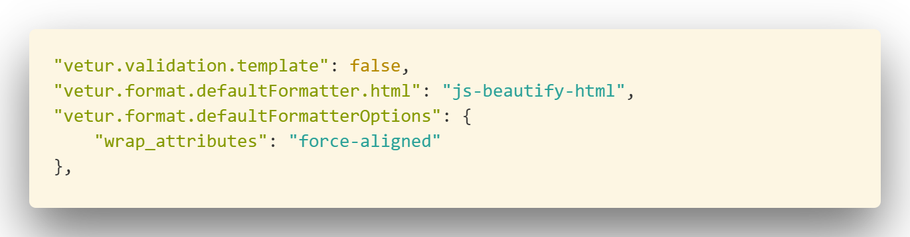

# Tips

[Code Pen MyTemplate](https://codepen.io/singlone/pen/JpjjwJ)

1.	PhoneGap / Cordova、AppCan、DCloud / APICloud，都是基于 WebKit 扩展的；
Weex 在 WebKit 与原生上实现了一个抽象层；
2.	NativeScript、React Native 基于原生实现了自己的统一 API；
3.	推荐前端入门跨平台 App 开发先学 Cordova，最简单、正规，社区最大

[How-To-Ask-Questions-The-Smart-Way](https://billing.virmach.com/clientarea.php?action=productdetails&id=82054)

---
> [HTML+CSS基础课程](https://www.imooc.com/learn/9)

# HTML
[MDN-Web/HTML](https://developer.mozilla.org/zh-CN/docs/Web/HTML)

[MDN-Web/API](https://developer.mozilla.org/en-US/docs/web/api)

[MDN-Web/API-zh-CN](https://developer.mozilla.org/zh-CN/docs/Web/API)

[300毫秒延迟](https://thx.github.io/mobile/300ms-click-delay#%E5%BD%93%E5%89%8D%E5%A6%82%E4%BD%95%E9%81%BF%E5%85%8D%E5%BB%B6%E8%BF%9F)

[移动端Web页面适配方案](https://funteas.com/topic/5a4d80ec1f635ce136730e10)

[理解HTML5的语义](https://www.adobe.com/devnet/archive/dreamweaver/articles/understanding-html5-semantics.html)

[mobie-first](https://abookapart.com/products/mobile-first)

[Making a Case for Mobile First Designs](https://www.sitepoint.com/making-case-mobile-first-designs/)

## Request
### referrerPolicy

## Element

**remenber this!**: `element.scrollHeight - element.scrollTop === element.clientHeight`

 ---

- .clientHeight
     
- .[offsetHeight](https://developer.mozilla.org/zh-CN/docs/Web/API/HTMLElement/offsetHeight)
     

<iframe height='265' scrolling='no' title='scrollHeight 演示Edit' src='//codepen.io/singlone/embed/ZvqymO/?height=265&theme-id=0&default-tab=html,result&embed-version=2' frameborder='no' allowtransparency='true' allowfullscreen='true' style='width: 100%;'>See the Pen <a href='https://codepen.io/singlone/pen/ZvqymO/'>scrollHeight 演示Edit</a> by ShoneSingLone (<a href='https://codepen.io/singlone'>@singlone</a>) on <a href='https://codepen.io'>CodePen</a>.
</iframe>


## Web_Components
[Web_Components](https://developer.mozilla.org/zh-CN/docs/Web/Web_Components)
- [自定义元素](https://developer.mozilla.org/zh-CN/docs/Web/Web_Components/Custom_Elements)
- [HTML模板](https://developer.mozilla.org/zh-CN/docs/Web/HTML/Element/template)
- [影子DOM](https://developer.mozilla.org/zh-CN/docs/Web/Web_Components/Shadow_DOM)
    - 
    >[Shadow-DOM](https://aotu.io/notes/2016/06/24/Shadow-DOM/index.html)
- [HTML导入](https://developer.mozilla.org/zh-CN/docs/Web/Web_Components/HTML_Imports)

[从HTML Components的衰落看Web Components的危机](https://github.com/xufei/blog/issues/3)

## canvas

[将图片转换base64格式，data:image/png;base64是什么？](http://blog.csdn.net/webxiaoma/article/details/70053444)

[Css中路径data:image/png;base64的用法详解](http://www.aimks.com/css-path-data-image-png-usage-base64.html)

[瞎折腾：把JS,CSS任意文本文件加密成一张图片](https://juejin.im/entry/5a41b3d66fb9a045154421cb?utm_medium=fe&utm_source=weixinqun)


### What
### Why 
### How
#### 基础
- 理解“画布”：指定id width、height
- 获取canvas对象：let canvas = document.getElementById();
- 获取二维context：context = canvas.context();(理解成画笔：有moveTo：抬手到哪个位置)
- 坐标系：↓→递增

#### 点、线
直线：moveTo


## SVG
[SVG](https://aotu.io/notes/2015/11/20/svg-I-know/)

# CSS
[divcss学习网站](http://www.divcss5.com/)

[值得参考的css理论：OOCSS、SMACSS与BEM](https://segmentfault.com/a/1190000000704006)

[MDN-Web/CSS](https://developer.mozilla.org/zh-CN/docs/Web/CSS)

[MDN-Web/CSS/Reference](https://developer.mozilla.org/zh-CN/docs/Web/CSS/Reference)

border的样式很重要
if `border：none;` 浏览器不会渲染border; 只有宽度，没有样式，也不会渲染, 所以一定要有样式才有效。 
##继承
颜色，文字，字体间距行高对齐方式，和列表的样式

- 所有元素可继承：visibility和cursor。
- 内联元素可继承：letter-spacing、word-spacing、white-space、line-height、color、font、font-family、font-size、font-style、font-variant、font-weight、text-decoration、text-transform、direction。
- 终端块状元素可继承：text-indent和text-align。
- 列表元素可继承：list-style、list-style-type、list-style-position、list-style-image。

## 层叠
- 特殊性、权重：ID选择器>Class选择器=伪类>标签名称选择器
- 顺序
- 重要性：！important

## 单位
[vm rem em](https://zhuanlan.zhihu.com/p/30413803?group_id=906220704115974144)
[width 100% ](https://www.lyblog.net/detail/286.html)
[css样式的百分比都相对于谁 ](https://www.zhihu.com/question/36079531)

```html
<html style="height: 100%;">
  <body style="height: 100%;">
    <div style="height: 100%;">
```
这在MaterialDesign的Demo当中，使用的是两个div使窗口划分为两个部分，各自按一定比例占满整个窗口。


## 文字排版
“文字”有什么？
- font-family:"微软雅黑";
- font-size:20px;
- color:green;//前景色
- font-weight:blod;
- font-style:italic;
- text-decrotion:none;||text-decoration:line-through;//装饰文本《HTML5于CSS3基础教程》一般用作锚去除下划线或者价格删除线。
- block:text-indent:2em;//行缩进
- block:line-height:2em;//行高
- letter-spacing:50px;||word-spacing//字母间距||单词间距
- text-align:center;||
- vertical-align:center;


## 盒子模型（box）

HTML每个元素都是大大小小的盒子。


我的理解——主要是分为两种：inline和block。
在两者的基础特性上，又有其他的组合效果如——inline-block


[标准模式与怪异模式对于渲染页面的影响](https://juejin.im/post/5a44aa4d518825146b10d69d?utm_medium=fe&utm_source=weixinqun)
- box-sizing: border-box;content-box;

- boder-box:border+padding+content
- boder-

## 行内元素（inline）和块级元素（block）

> [说说行内元素和块级元素](http://www.jianshu.com/p/d69878549d92)

### inline
1. 和其他元素都在一行上；
1. 元素的高度、宽度及顶部和底部边距不可设置；
1. **包裹**里面的文字或图片，尽量收缩：元素的宽度就是它包含的文字或图片的宽度，不可改变。

### block
1. 一个块级元素独占一行；
1. 元素的高度、宽度、行高以及顶和底边距都可设置；
1. **撑**：元素宽度在不设置的情况下，是它本身父容器的100%（和父元素的宽度一致），除非设定一个宽度。

#### 宽度和高度
css内定义的宽（width）和高（height），指的是填充以里的内容范围。 因此一个元素实际宽度（盒子的宽度）=左边界+左边框+左填充+内容宽度+右填充+右边框+右边界。
> 
- 标准盒子模型 ＝ margin + border + padding + content （content =  width | height）
- IE盒子模型 ＝ margin + content （content = border + padding + width | height）


[深入理解父元素与子元素的width关系](http://www.cnblogs.com/zhuzhenwei918/p/6389567.html)

### inline-block

`absolute`和`float`可是元素隐性变为 `inline-block`
1. 和其他元素都在一行上；
1. 元素的高度、宽度、行高以及顶和底边距都可设置。


值	|描述
---|---
content-box	|这是由 CSS2.1 规定的宽度高度行为。 宽度和高度分别应用到元素的内容框。 在宽度和高度之外绘制元素的内边距和边框。
border-box	| 为元素设定的宽度和高度决定了元素的边框盒。 就是说，为元素指定的任何内边距和边框都将在已设定的宽度和高度内进行绘制。 通过从已设定的宽度和高度分别减去边框和内边距才能得到内容的宽度和高度。
inherit|规定应从父元素继承 box-sizing 属性的值。


[如何让 height:100%; 起作用](http://www.webhek.com/post/css-100-percent-height.html)
[如何让 height:100%; 起作用](http://www.divcss5.com/rumen/r613.shtml)
高度跟父元素有关，所以如果要使height起作用，需要

行内元素（伪） | 语义| |块级元素| 语义
---|---|---|---|---
a        | 锚                                 | | address    | 地址
abbr     | 缩写                               | | blockquote | 块引用
acronym  | 首字                               | | center     | 居中对齐块
b        | 粗体（不推荐）                     | | dir        | 目录列表
bdo      | bidi override                      | | **div**    | （无语义的块级元素）
big      | 大字体                             | | dl         | 定义列表
br       | 换行                               | | fieldset   | form表单控制组（group）
cite     | 引用                               | | form       | 交互表单
code     | 计算机代码（在引用源码的时候需要） | | h1         | 大标题
dfn      | 定义字段                           | | h2         | 副标题
em       | 强调                               | | h3         | 3级标题
font     | 字体设定（不推荐）                 | | h4         | 4级标题
i        | 斜体                               | | h5         | 5级标题
~~img~~      | 图片                               | | h6         | 6级标题
~~input~~    | 输入框                             | | hr         | 水平分隔线
kbd      | 定义键盘文本                       | | isindex    | input prompt
label    | 表格标签                           | | menu       | 菜单列表
q        | 短引用                             | | noframes   | frames可选内容（对于不支持frame的浏览器显示此区块内容）
s        | 中划线（不推荐）                   | | noscript   | 可选脚本内容（对于不支持script的浏览器显示此内容）
samp     | 定义范例计算机代码                 | | ol         | 排序列表
select   | 项目选择                           | | p          | 段落
small    | 小字体文本                         | | pre        | 格式化文本
**span** | 常用内联容器，定义文本内区块       | | table      | 表格
strike   | 中划线                             | | ul         | 非排序列表
strong   | 粗体强调                           |
sub      | 下标                               |
sup      | 上标                               |
textarea | 多行文本输入框                     |
tt       | 电传文本                           |
u        | 下划线                             |
var      | 定义变                             |

- 转换：float\display\position

##

- [使用 CSS overscroll-behavior 控制滚动行为：自定义下拉刷新和溢出效果](https://github.com/dev-reading/fe/blob/master/articles/2017-11-15-overscroll-behavior.md)
- [禁止遮罩层以下屏幕滑动----正解(更新版)](http://www.cnblogs.com/gaohui/p/5819777.html)
## @font-face
glyphicons 矢量图

## 图片和背景

[滤镜](https://developer.mozilla.org/en-US/docs/Web/CSS/filter)
filter:blur(5px);模糊
[高级CSS filters](https://www.w3cplus.com/css3/advanced-css-filters.html)

- background-image:url();//相对路径是相对样式表文件而言
- GIF JEPG PNG8 24 32
    - 个人理解两个方面：
        - 动画就是gif alpha图就是png 一般高压缩又色彩丰富就是jpeg **（这个角度就差不多够了）**
        - GIF PNG8/JPEG PNG24 PNG32 都是png质量更好但是size大，png有alpha渐变（PNG24 alpha只有一种颜色）
- background-repeat: repeat no-repeat repeat-x repeat-y round space
### 定位
- background-position：
    - 关键字：left center right top bottom ；
    - 百分比：把指定的背景图比例位置与目标元素相同的比例位置对齐；
### 固定
- background-attachment：
    - fixed scroll
### 背景的起点和显示区域
-


linear-gradient（角度deg，起始颜色 20%，transparent），多个渐变色可叠加，换不同角度
radial-gradient（closest-side closest-corner farthest-side farthest-corner)

figure
img 图
figcaption 图题


## 变形 过渡 动画 
- transform:
    - rotate
    - scale
    - translate:(X/Y/Z)
    - skew
    - origin

- transition:
    - transition-property:transform length opcity font color margin border padding 
    - transition-duration:
    - transition-timing-function: linear ease ease-in ease-out ease-in-out cubic-bezier
    - transition-delay:

- animation
    - @keyframes
    - animation-name：
    - animation-duration：
    - animation-timing-function: ease-in-out cubic-bezier
    - animation-delay:
    - animation-itration-count：infinite（无限）
    - animation-direction： alternate(交替轮流)
    - animation-fill-mode: forwards
    - animation-play-state: running paused


 [CSS3 逐渐发光的方格边框](http://caibaojian.com/css-light.html)
 
 

## 装饰表格和表单
表格是用来展示数据的。
- table
    - tr
        - td
padding 
text—align:left right center justfied
vertical-align:top baseline middle bottom

### 创建边框
border:针对table的border和th的border效果不一样
- 去掉双重边框：border-collapse：separator：分开并且边重叠 collapse：
- 圆角：在border-collapse默认为separator的情况下可以使用圆角否则就不起作用为直角
- 控制单元格之间的间隙：border-spaceing:用于控制边框间的间隙

### 装饰行和列
- nth-of-type：子类型选择符

### 装饰表单
[10 CSS HTML Form Designs](https://www.sanwebe.com/2014/08/css-html-forms-designs)

label 标记通常以下面两种方式中的一种来和表单控件相联系：将表单控件作为标记标签的内容，这样的就是隐式形式，或者为 <label> 标签下的 for 属性命名一个目标表单 id，这样就是显式形式。

```html
显式的联系：
<label for="SSN">Social Security Number:</label>
<input type="text" name="SocSecNum" id="SSN" />

隐式的联系：
<label>Date of Birth: <input type="text" name="DofB" /></label>
```

通常是一个label和一个input
label就设定好宽度，右对齐，间隔margin
input


### 布局模型
 
元素有三种布局模型：
1. 流动模型（Flow）/ 标准文档流
1. 浮动模型 (Float)
1. 层模型（Layer）

#### 流动模型（Flow）/ 标准文档流

1. 块状元素都会在所处的包含块内自上而下按顺序垂直延伸分布
1. 内联元素都会在所处的包含元素内从左到右水平分布显示。

#### 浮动模型 (Float)
浮动使之脱离标准文档流。效果类似inline-block且无元素间间距。
浮动用来设置文字环绕，也可以用来布局，**bootstrap栅栏系统**是利用浮动设计的。

- [清除浮动](http://nicolasgallagher.com/micro-clearfix-hack/)
- fix float所产生的塌陷/元素下坠
    - [利用:after伪类元素清除](http://www.html-js.com/article/2203)
    - [Why does overflow hidden stop floating elements escaping their container?](https://stackoverflow.com/questions/9193214/why-does-overflow-hidden-stop-floating-elements-escaping-their-container)
    - [BFC 块级格式化上下文](http://web.jobbole.com/83149/)+ [CSS之BFC详解](http://www.html-js.com/article/1866)+[](http://www.10tiao.com/html/59/201712/2651553261/1.html)
    **BFC特性**
		1. 内部的Box会在垂直方向，从顶部开始一个接一个地放置。
		1. Box垂直方向的距离由margin决定。属于同一个BFC的两个相邻Box的margin会发生叠加
		1. 每个元素的margin box的左边， 与包含块border box的左边相接触(对于从左往右的格式化，否则相反)。即使存在浮动也是如此。
		1. BFC的区域不会与float box叠加。
		1. BFC就是页面上的一个隔离的独立容器，容器里面的子元素不会影响到外面的元素，反之亦然。
		1. 计算BFC的高度时，浮动元素也参与计算。
		---
		**作用**

		1. 说的
		1. 解决margin叠加问题 
		1. 布局[CSS之BFC详解](http://www.html-js.com/article/1866)
		1. 用于清除浮动，计算BFC高度.
		---

		`overflow: hidden;`只是创建BFC的方式之一，比较常用。

		- `display: table` 可能引发响应性问题
		- `overflow: scroll` 可能产生多余的滚动条
		- `float: left` 将把元素移至左侧，并被其他元素环绕
		- `overflow: hidden` 将裁切溢出元素

Inline-block和浮动布局的区别？

#### 层模型

1. 绝对定位(position: absolute)
    - 将元素从文档流中拖出来，然后使用left、right、top、bottom属性相对于其最接近的一个具有定位属性的父包含块进行绝对定位。如果不存在这样的包含块，则相对于body元素，即相对于浏览器窗口。
1. 相对定位(position: relative)
    - 通过left、right、top、bottom属性确定元素在正常文档流中的偏移位置。
1. 固定定位(position: fixed)：位置效果使用`background-attachment:fixed`
    - position:fixed;并不只是相对于窗口定位：CSS3的transform会影响定位；
     [相对于父元素的FIXED定位的实现](http://www.cnblogs.com/biyesheng/p/6386176.html)

     [相对于父元素的FIXED定位的实现:transform](https://code.w3ctech.com/detail/1305)
    - ```css
        <!DOCTYPE html>
        <html lang="en">

        <head>
            <meta charset="UTF-8">
            <meta name="viewport" content="width=device-width, initial-scale=1.0">
            <meta http-equiv="X-UA-Compatible" content="ie=edge">
            <title>Document</title>
            <style>
                * {
                    margin: 0;
                    padding: 0;
                }

                html {
                    height: 100%;
                }

                body {
                    background: #ccc;
                    height: 100%;
                    transform: translateZ(0);
                }

                .absolute {
                    /* transform: translateZ(0); */
                    height: 600px;
                    width: 650px;
                    background: #d36d6d;
                    overflow: auto;
                    position: relative;
                    left: 200px;
                    top: 100px;
                }

                .fixed {
                    background-color: rgba(248, 1, 1, 0.856);
                    width: 100%;
                    position: fixed;
                    /*不要设置top,left,bottom,right*/
                }

                .content {
                    /*为了撑起absolute的高度*/
                    background-color: aqua;
                    /* float: left; */
                    height: 1800px;
                    width: 300px;
                }

                .content>p {
                    background-color: rgba(16, 49, 233, 0.198);
                    height: 100px;
                }

                img {
                    width: 40%;
                    /* height: 15px; */
                }
            </style>


        </head>

        <body> body
            <div class="absolute"> absolute
                <div class="content">
                    <p>content :height 100px;</p>
                    <div class="fixed">fixed</div>
                </div>
            </div>

        </body>

        </html>
         ```

## 布局

[Layout Generators](http://www.pagecolumn.com/)
[Templated](https://templated.co/)
[Layout Gala](https://blog.html.it/layoutgala/index.html)


布局的策略：从左到右，从上到下；
vertical-align：top
line-height

### 居中
1. 水平居中
    1. 行内元素：通过给父元素设置 text-align:center
    1. 块状元素：
        1. 定宽：满足定宽和块状两个条件的元素是可以通过设置“左右margin”值为“auto”来实现居中的。
        1. 不定宽：
            1. 加入 table 标签：table标签的长度自适应性---即不定义其长度也不默认父元素body的长度（table其长度根据其内文本长度决定），因此可以看做一个定宽度块元素，然后再利用定宽度块状居中的margin的方法，使其水平居中。
            1. 设置 `display: inline` 方法：使block元素变为inline，类似行内元素的方法
            1. 设置 position:relative 和 left:50%：利用 相对定位 的方式，将元素向左偏移 50% ，即达到居中的目的。
            ```html
            <!DOCTYPE HTML>
            <html>
            <head>
            <meta charset="utf-8">
            <title>不定宽块状元素水平居中</title>
            <style>
            .container{
                float:left;
                position:relative;
                left:50%
            }
            .container ul{
                list-style:none; 
                margin:0;
                padding:0;
                position:relative;
                left:-50%;
            }
            .container li{float:left;display:inline;margin-right:8px;}
            .wrap-center{
                background:#ccc;
            }
            </style>
            </head>

            <body>
            <div class="container">
                <ul>
                    <li><a href="#">1</a></li>
                    <li><a href="#">2</a></li>
                    <li><a href="#">3</a></li>
                </ul>
            </div>

            <!--下面是代码任务区-->
            <div class="wrap">
                <div class="wrap-center">我们来学习一下这种方法。</div>
            </div>
            </body>
            </html>
            ```
            
1. 垂直居中
    1. 父元素高度确定
        1. 单行文本:通过设置height 和 line-height 高度一致来实现的。
        <script src='http://runjs.cn/gist/11yepad9/all'></script>
            - ```
            <style>
            .container{
                height:100px;
                line-height:100px;
                background:#999;
            }
            </style>
            ```
        1. 多行文本或图片：
            1. 使用插入 table  (包括tbody、tr、td)标签，同时设置 vertical-align：middle。
            1. 在 chrome、firefox 及 IE8 以上的浏览器下可以设置块级元素的 display 为 table-cell（设置为表格单元显示），激活 vertical-align 属性，但注意 IE6、7 并不支持这个样式, 兼容性比较差。相当于内置了方法1.

[css3-tooltip](http://www.menucool.com/tooltip/css3-tooltip)
[css3-tooltip](http://caibaojian.com/css3-tooltip.html)

### 固定
### 不固定
#### 浮动
#### 流式布局
#### 响应式布局

### flex布局
[深入理解 flex 布局以及计算](https://www.w3cplus.com/css3/flexbox-layout-and-calculation.html)
[Flex 布局教程](http://www.ruanyifeng.com/blog/2015/07/flex-grammar.html)
[Flex 布局教程 实例](http://www.ruanyifeng.com/blog/2015/07/flex-examples.html)
[Flex 布局教程 demo](http://static.vgee.cn/static/index.html)
[FLEX-LAYOUT](https://github.com/Coffcer/flex-layout)
[solved-by-flexbox/](https://hufan-akari.github.io/solved-by-flexbox/)

 flex分为两个部分：一个是container 用作包裹；另一个是item，被包裹的元素。container可以指定排列的方向（flex-direction）和换行的方式（flex-wrap）。

 **flex-direction**属性指定了内部元素是如何在 flex 容器中布局的，定义了主轴的方向(正方向或反方向)。意思就是当`flex-directin:column;`时，justify axis变成了Y轴。
 
 注意到这里的baseline和content的around就可以理解到这两者的区别：content是main和cross上的分部，而align-items就是item内部的布局基准。align又有stretch属性，在cross轴上特有。
 尽量是不要自动换行，设计为row和column的方式：指定column。


[mindmap](http://naotu.baidu.com/file/c629a9abd17ecd60f59bc98dcfe5a4fe)


### 瀑布流
[瀑布流布局的实现步步升级（原生JS）](http://www.dengzhr.com/js/405)
[Web前端实现瀑布流的几种方法](http://www.jianshu.com/p/d4ca937c6f96?from=jiantop.com)
[Web前端实现瀑布流的几js实现瀑布流的三种方式比较，js瀑布三种方式种方法](http://www.jianshu.com/p/d4ca937c6f96?from=jiantop.com)
[纯js实现瀑布流布局及ajax动态新增数据  ](https://www.teakki.com/p/5901f3cab819c55a2789c289)


[多行文本'...'](https://qianduan.group/posts/5a9ff0e80cf6b624d2239cc8)


# Network 网络
>《图解HTTP》

## HTTP
[超文本转移协议](http://www.cnblogs.com/gudi/p/6959715.html) /超文本传输协议

历史：1990-1993=>1994=>1995=>1996=>1997

### TCP/IP协议族
#### 分层
分层模式(Layered Architecture)、关注分离（separation of concerns）

- 应用层：HTTP、FTP、DNS=>HTTP请求是一份协议，是一份描述
- 传输层：TCP、UDP（用户数据报协议 user data protocol）=>根据描述对数据进行分割打上标记序号和端口号
- 网络层：IP=>主机到主机的通信服务：选路径（forwarding and routing）
- 数据链路、物理层：MAC地址=>

HTTP报文→|应用层|→TCP首部→|传输层|→IP数据包→|网络层|→网络架构...

#### 与HTTP关系密切的协议
- IP：各种数据包传送到对方
    - IP地址
    - MAC地址
- UDP：确保可靠性（HTTP无状态是什么意思？）（挖坑）
    - three-way handshaking保证传输
- DNS


## 状态码
- 403：客户端没有访问权限
- 404：客户端请求出现错误，请求的资源是不存在的
- 304：重定向，资源在某处有缓存，可以直接取用，不需要向原始地址发起请求。
- 500：服务器问题

## WebSocket
[使用 WebSocket 构建实时性应用](https://juejin.im/post/5a3cb04951882525822793f5?utm_medium=fe&utm_source=weixinqun)

[WebSocket：5分钟从入门到精通](https://mp.weixin.qq.com/s?__biz=MzAxODE2MjM1MA==&mid=2651553461&idx=1&sn=1df66f564e85db96c3ef54d1790598f2&chksm=8025a974b752206280bc284e4d3288a5c357c4ff8bb427b38482e8b04c490a5ee833bb000100&mpshare=1&scene=1&srcid=0108XAs9DBEN2xOygi5rs2pB#rd)

# 数据结构和算法
### 数组

其他|---
---|---
Unshift=》|《=Push
《=Shift|Pop=》

后进先出Stack

Stack
## Queen


<iframe height='265' scrolling='no' title='Queen' src='//codepen.io/singlone/embed/preview/LQYYMz/?height=265&theme-id=dark&default-tab=js,result&embed-version=2' frameborder='no' allowtransparency='true' allowfullscreen='true' style='width: 100%;'>See the Pen <a href='https://codepen.io/singlone/pen/LQYYMz/'>Queen</a> by ShoneSingLone (<a href='https://codepen.io/singlone'>@singlone</a>) on <a href='https://codepen.io'>CodePen</a>.
</iframe>


Link

# SSH

[解释-Secure Shell](https://zh.wikipedia.org/wiki/Secure_Shell):
>是一种加密的网络传输协议，可在不安全的网络中为网络服务提供安全的传输环境。SSH通过在网络中创建安全隧道来实现SSH客户端与服务器之间的连接。

# ubuntu开启SSH服务

[Ubuntu环境下SSH的安装及使用](http://blog.csdn.net/netwalk/article/details/12952051)

[Ubuntu开启SSH登录](https://segmentfault.com/a/1190000004686476)

SSH分客户端openssh-client和openssh-server
如果你只是想登陆别的机器的SSH只需要安装openssh-client
```shell
#buntu有默认安装，如果没有则
sudo apt-get install openssh-client
```
如果要使本机开放SSH服务就需要安装openssh-server
```shell
sudo apt-get install openssh-server
```
确认sshserver是否启动了：
```shell
ps -e |grep ssh
```
如果看到sshd那说明ssh-server已经启动了。
如果没有则可以这样启动：sudo /etc/init.d/ssh start 或者 service ssh start
ssh-server配置文件位于/etc/ssh/sshd_config，在这里可以定义SSH的服务端口，默认端口是22，你可以自己定义成其他端口号，如222。
然后重启SSH服务：
sudo 
/etc/init.d/ssh stop
sudo /etc/init.d/ssh start
登陆SSH：
```shell
ssh username@host
```

# Git
[Gitflow](https://github.com/xirong/my-git)
Git工作流是很重要的多人协作方式。学习方式首先是理解应用场景，也就是为什么要用这样的工具，那些时候用，具体怎么用。

[搭建Git服务器](https://www.liaoxuefeng.com/wiki/0013739516305929606dd18361248578c67b8067c8c017b000/00137583770360579bc4b458f044ce7afed3df579123eca000)

[在服务器上搭建 Git](https://git-scm.com/book/zh/v1/%E6%9C%8D%E5%8A%A1%E5%99%A8%E4%B8%8A%E7%9A%84-Git-%E6%9E%B6%E8%AE%BE%E6%9C%8D%E5%8A%A1%E5%99%A8)

[windows下git库的ssh连接，使用public key的方法](http://blog.csdn.net/longshenlmj/article/details/9408549)

```js
npm install --global gulp-cli
```

### 架设服务器

现在我们过一边服务器端架设 SSH 访问的流程。本例将使用 authorized_keys 方法来给用户授权。我们还将假定使用类似 Ubuntu 这样的标准 Linux 发行版。首先，创建一个名为 'git' 的用户，并为其创建一个 .ssh 目录。

```shell
$ sudo adduser git
$ su git
$ cd
$ mkdir .ssh
```
接下来，把开发者的 SSH 公钥添加到这个用户的 authorized_keys 文件中。假设你通过电邮收到了几个公钥并存到了临时文件里。重复一下，公钥大致看起来是这个样子：
```shell
$ cat /tmp/id_rsa.john.pub
ssh-rsa AAAAB3NzaC1yc2EAAAADAQABAAABAQCB007n/ww+ouN4gSLKssMxXnBOvf9LGt4L
ojG6rs6hPB09j9R/T17/x4lhJA0F3FR1rP6kYBRsWj2aThGw6HXLm9/5zytK6Ztg3RPKK+4k
Yjh6541NYsnEAZuXz0jTTyAUfrtU3Z5E003C4oxOj6H0rfIF1kKI9MAQLMdpGW1GYEIgS9Ez
Sdfd8AcCIicTDWbqLAcU4UpkaX8KyGlLwsNuuGztobF8m72ALC/nLF6JLtPofwFBlgc+myiv
O7TCUSBdLQlgMVOFq1I2uPWQOkOWQAHukEOmfjy2jctxSDBQ220ymjaNsHT4kgtZg2AYYgPq
dAv8JggJICUvax2T9va5 gsg-keypair
```
只要把它们逐个追加到 authorized_keys 文件尾部即可：
```shell
$ cat /tmp/id_rsa.john.pub >> ~/.ssh/authorized_keys
$ cat /tmp/id_rsa.josie.pub >> ~/.ssh/authorized_keys
$ cat /tmp/id_rsa.jessica.pub >> ~/.ssh/authorized_keys
```
现在可以用 --bare 选项运行 git init 来建立一个裸仓库，这会初始化一个不包含工作目录的仓库。

```shell
$ cd /opt/git
$ mkdir project.git
$ cd project.git
$ git --bare init
```
这时，Join，Josie 或者 Jessica 就可以把它加为远程仓库，推送一个分支，从而把第一个版本的项目文件上传到仓库里了。值得注意的是，每次添加一个新项目都需要通过 shell 登入主机并创建一个裸仓库目录。我们不妨以 gitserver 作为 git 用户及项目仓库所在的主机名。如果在网络内部运行该主机，并在 DNS 中设定 gitserver 指向该主机，那么以下这些命令都是可用的：

[can't push (unpacker error) related to permission issues](https://stackoverflow.com/questions/4025708/git-cant-push-unpacker-error-related-to-permission-issues) 

```shell
$ cd /**/**.git
$ sudo chown -R git:git .
```

# 在 John 的电脑上

```shell
$ cd myproject
$ git init
$ git add .
$ git commit -m 'initial commit'
$ git remote add origin git@gitserver:/opt/git/project.git
$ git push origin master
```

这样，其他人的克隆和推送也一样变得很简单：

```shell
$ git clone git@gitserver:/opt/git/project.git
$ cd project
$ vim README
$ git commit -am 'fix for the README file'
$ git push origin master
```

用这个方法可以很快捷地为少数几个开发者架设一个可读写的 Git 服务。

作为一个额外的防范措施，你可以用 Git 自带的 git-shell 工具限制 git 用户的活动范围。只要把它设为 git 用户登入的 shell，那么该用户就无法使用普通的 bash 或者 csh 什么的 shell 程序。编辑 /etc/passwd 文件：
```shell

$ sudo vim /etc/passwd
```

在文件末尾，你应该能找到类似这样的行：
```shell

git:x:1000:1000::/home/git:/bin/sh
```

把 bin/sh 改为 /usr/bin/git-shell （或者用 which git-shell 查看它的实际安装路径）。该行修改后的样子如下：
```shell

git:x:1000:1000::/home/git:/usr/bin/git-shell
```
现在 git 用户只能用 SSH 连接来推送和获取 Git 仓库，而不能直接使用主机 shell。尝试普通 SSH 登录的话，会看到下面这样的拒绝信息：
```shell

$ ssh git@gitserver
fatal: What do you think I am? A shell?
```
 在创建用户时，需要为新建用户指定一用户组，如果不指定其用户所属的工作组，自动会生成一个与用户名同名的工作组。创建用户user1的时候指定其所属工作组users，例：useradd –g users user1

一、创建用户：

1、使用命令 useradd

例：useradd user1——创建用户user1
    useradd –e 12/30/2009 user2——创建user2,指定有效期2009-12-30到期
    用户的缺省UID从500向后顺序增加，500以下作为系统保留账号，可以指定UID，

例：useradd –u 600 user3

   

2、使用 passwd 命令为新建用户设置密码
例：passwd user1
注意：没有设置密码的用户不能使用。

 

3、命令 usermod 修改用户账户
例：将用户 user1的登录名改为  u1，
usermod –l u1 user1
例：将用户 user1 加入到 users组中，
usermod –g users user1


例：将用户 user1 目录改为/users/us1
usermod –d /users/us1 user1

 

4、使用命令 userdel 删除用户账户
例：删除用户user2
userdel user2
例：删除用户 user3，同时删除他的工作目录
userdel –r user3

 

5、查看用户信息
id命令查看一个用户的UID和GID, 例：查看user4的id
id user4
finger命令 ——可以查看用户的主目录、启动shell、用户名、地址、电话等信息
例：finger user4

 

 

二、用户组：

6、命令 groupadd创建用户组
groupadd –g 888 users
创建一个组users，其GID为888

 

7、命令 gpasswd为组添加用户
只有root和组管理员能够改变组的成员：
例：把 user1加入users组
gpasswd –a user1 users
例：把 user1退出users组
gpasswd –d user1 users

8、命令groupmod修改组
groupmod –n user users       修改组名user为users


9、groupdel删除组
groupdel users    删除组users

ubuntu和windows一样，可以任意创建或者删除新的用户，windows下比较简单，ubuntu下需要使用命令，不过操作起来不是很繁琐，所以我尽量写的详细一些。

          如何创建ubuntu新用户？

          首先打开终端，输入：sudo adduser username，系统会提示以下信息：

           正在添加用户“username”...

           正在添加新组“username”(1001)...

           正在添加新用户“username”(1001)到组“username”...

           创建主目录“/home/username”...

            正在从“/etc、skel”复制文件...

            输入新的 UNIX 口令：(此处大家注意，不是输入你当前用户的密码，而是输入你要创建新用户的密码)

            重新输入新的 UNIX 口令：(再输一次即可)

            passwd：已成功更新密码

            Changing the user information for username
            Enter the new value, or press ENTER for the default
            Full Name []: yangyang (输入新用户的名称)
            Room Number []:
            Work Phone []:
            Home Phone []:
            Other []:
这个信息是否正确? [Y/n] y

            到了这一步，新用户已经添加成功了，此时我们可以打 ls /home查看一下，如果显示 username yang，侧代表用户创建成功。

          如何删除ubuntu用户？

          ubuntu删除用户同样是在终端下操作的，需要注意的是，如果要删除的用户当前已登陆，是删除不掉的，必须注销掉当前用户切换为另一个用户下，才能删除。举个例子，刚才我新建立了一个用户为 yang 的用户，例如我现在用用户 yang 登陆了桌面，此时如果我想删除 yang 这个用户，是删除不掉的。正确的操作方法是，我注销掉 yang，然后使用 root 登陆到桌面，再删除 yang 即可。

          删除ubuntu用户的命令比较容易记：sudo userdel username，例如我想删除 yang ，则输入：sudo userdel yang，删除成功后，系统无任何提示。
```

安装git，apt-get install git
创建git用户和git用户组，分配目录/home/git，然后vim /etc/passwd
将 ： git:x:1003:1003::/home/git:
改成：git:x:1003:1003::/home/git:/usr/bin/git-shell
禁用git用户的shell
在/home/git下创建.ssh文件夹
在.ssh下创建authorized_keys文件，如果无效查看/etc/ssh/sshd_config文件一行：（AuthorizedKeysFile
%h/.ssh/authorized_keys）有没有被注释掉，重启ssh服务，service ssh restart

作者： 紫帆梓 
链接：http://www.imooc.com/article/4697
来源：慕课网

## 基本操作
[Git-Commands](https://aotu.io/notes/2015/11/17/Git-Commands/)

`git pull = git fetch + merge to local-`


## GitHub

## Webhook
[github-webhook](https://developer.github.com/webhooks/)

[gitlab-webhook](https://docs.gitlab.com/ee/user/project/integrations/webhooks.html)

[使用Github的webhooks进行网站自动化部署](https://aotu.io/notes/2016/01/07/auto-deploy-website-by-webhooks-of-github/index.html)
(挖坑)
[leancloud/node-js-getting-started自动部署](https://github.com/leancloud/node-js-getting-started)

当使用Git工具完成Push操作后会触发一个事件，这个事件会传播到目标服务器，目标服务器会运行脚本完成部署相关的一些列操作（git pull）


## Git workflow.
[Git workflow. 产品测试发布流程及 gitflow 工作流经验总结](https://github.com/zhaotoday/product-workflow)

## licence

>[需要知道的开源许可证](http://www.ruanyifeng.com/blog/2011/05/how_to_choose_free_software_licenses.html)
[各种开源协议介绍](http://www.open-open.com/solution/view/1319816219625)


# OOP
MixIn混入[多重继承](https://www.liaoxuefeng.com/wiki/0014316089557264a6b348958f449949df42a6d3a2e542c000/0014318680104044a55f4a9dbf8452caf71e8dc68b75a18000)

使用组合的形式更加灵活，解耦。类似图书馆的分类方式，如果用标签来查找更容易。

# MVC分型
# 结构的设计方式

- 职责单一
- 高内聚低耦合
- Shell作为唯一的入口。
- 调用其他模块的接口。

# TaskRunner
- 开发阶段
    - 刷新 BrowserSync
    - 预处理 Sass
    - 代码分析 ESLint
    - 持续测试

- 构建阶段
    - 预处理
    - 文件串联
    - 混缩 minification
    - 持续集成 Continuous Integration Jenkins


# NodeJS
## 模块
模块=》包=》包管理
- what
    jar听说过没有呀？高内聚低耦合，实现相关功能
- how
    - 单个文件(.js)
    - exports 和 require 


## npm
[npm 中文文档](https://www.npmjs.com.cn/)
[npm English](https://docs.npmjs.com/getting-started/what-is-npm)

```cmd
> npm install npm@latest -g
> npm install -g <package_name> --save-dev
> npm update <package_name>
> npm uninstall -g <package_name> --save-dev

```

[tree-cli:生成目录树](https://www.npmjs.com/package/tree-cli)
在windows下与CMD:tree冲突，就将tree.cmd rename=>ntree.cmd
所以命令就是`ntree`

```
tree -l 2 --ignore 'node_modules/, .git/, .gitignore' -o tree.txt
//-d: list directories only.
//-l: level max display depth of the directory tree.
//--ignore: ignores directory or file you specify - accepts arrays as comma-delimited strings: 'node_modules/, .git/, .gitignore'
```


在Node.js中有个字符串解码类，可以通过require('string_decoder')引用后，使用这个模块。字符串解码器StringDecoder可以将缓存Buffer解码为字符串，StringDecoder是buffer.toString()方法的简单实现。在Node.js的child_process、crypto、readline等核心模块中，都引用了这个模块。


1. 引用及初始化
require('string_decoder')引用后，需要通过new关键字创建StringDecoder对象实现。构造函数接受一个encoding参数，可接受的编码格式有：utf8、ucs2、utf16le、base64，默认为utf8。

 var StringDecoder = require('string_decoder').StringDecoder;
var decoder = new StringDecoder('utf8');

2. StringDecoder类中的方法
decoder.write(buffer)：返回解码后的字符串
decoder.end(buffer)：返回Buffer中所有的剩余字节
decoder.detectIncompleteChar(buffer)：根据编码规则设置有效编码字节
var StringDecoder = require('string_decoder').StringDecoder;
var decoder = new StringDecoder('utf8');

var cent = new Buffer([0xC2, 0xA2]);
console.log(decoder.write(cent));

var euro = new Buffer([0xE2, 0x82, 0xAC]);
console.log(decoder.write(euro));


### 服务器
[Node.js静态文件服务器实战](http://www.infoq.com/cn/news/2011/11/tyq-nodejs-static-file-server)
[node.js 一个简单的页面输出](http://www.cnblogs.com/rubylouvre/archive/2011/11/20/2255083.html)


### Express
- [Express上手](https://mp.weixin.qq.com/s/Q2AF4t-GMzwErxXp_WDtLw)
- 安装
```
npm install express --save
```
- 路由
```js
// 对网站首页的访问返回 "Hello World!" 字样
app.get('/', function (req, res) {
  res.send('Hello World!');
});
// 网站首页接受 POST 请求
app.post('/', function (req, res) {
  res.send('Got a POST request');
});
// /user 节点接受 PUT 请求
app.put('/user', function (req, res) {
  res.send('Got a PUT request at /user');
});
// /user 节点接受 DELETE 请求
app.delete('/user', function (req, res) {
  res.send('Got a DELETE request at /user');
});
```

## 上传 下载
[Nodejs进阶：基于express+multer的文件上传](https://www.cnblogs.com/chyingp/p/express-multer-file-upload.html)

[使用nodejs+express完成简单的文件上传功能](https://juejin.im/post/5a4263816fb9a045211ef85c)

[FormData 对象的使用](https://developer.mozilla.org/zh-CN/docs/Web/API/FormData/Using_FormData_Objects)

[FileReader.readAsDataURL()](https://developer.mozilla.org/zh-CN/docs/Web/API/FileReader/readAsDataURL)

[简单的接收文件上传下载（Express+Multer）](https://www.jianshu.com/p/15423d1b6243)

[express文件上传中间件Multer最新使用说明](https://cnodejs.org/topic/564f32631986c7df7e92b0db)

[Node.js(Express)上传文件处理中间件 multer](https://itbilu.com/nodejs/npm/N1xidECcZ.html)

[URLSearchParams](https://developer.mozilla.org/en-US/docs/Web/API/URLSearchParams)

[Node Express获取参数的几种方式](http://xuyuan923.github.io/2014/10/10/node-tutorial-req/)


## Yarn[官网](https://yarnpkg.com/zh-Hans/)
## cli对比 [migrating-from-npm](https://yarnpkg.com/zh-Hans/docs/migrating-from-npm)


### npm  scripts

简单来说，npm script学习了Gulp的优点。

>[npm scripts 使用指南](http://www.ruanyifeng.com/blog/2016/10/npm_scripts.html) package.json文件中的`script`:
[how-to-use-npm-as-a-build-tool](http://bubkoo.com/2016/03/18/how-to-use-npm-as-a-build-tool/)
[⚓用npm执行脚本](http://leungwensen.github.io/blog/2016/running-scripts-with-npm.html)
[Node.js 命令行程序开发教程](http://www.ruanyifeng.com/blog/2015/05/command-line-with-node.html)
[npm scripts 用法详解](https://segmentfault.com/a/1190000007684156)
[npm scripts](https://www.zybuluo.com/yangfch3/note/249328)
[使用Node.js创建命令行脚本工具](https://aotu.io/notes/2015/12/23/building-command-line-tools-with-node-js/)
`npm run <自定义命令>`

[npm 模块安装机制简介](http://www.ruanyifeng.com/blog/2016/01/npm-install.html)
```bash
npm install -g npm-cache
```

原理：
应该是若非全局安装就是npm的机制（卸载packa.json中 运行npm run）才会在.bin下查找。不然就要加上路径或者加入Path

### Gulp
[使用npm scripts替代gulp](https://aotu.io/notes/2016/02/26/use-npm-script-instead-of-gulp/index.html)
[Gulp get start](http://www.gulpjs.com.cn/docs/getting-started/)
[Gulp入门教程](http://www.jianshu.com/p/fbf9871dc47a)
[Gulp v4编译Bootstrap-sass v3.3.7](http://www.jianshu.com/p/ac93605e4cf2)
[gulp-and-babel](http://macr.ae/article/gulp-and-babel.html)
[译-用gulp来实现web服务器](https://www.jianshu.com/p/e66a5bb96b7e)

### Webpack
#### What？
[官网](https://doc.webpack-china.org/concepts/)
[Webpack from First Principles](https://www.youtube.com/watch?v=WQue1AN93YU)

>webpack 是一个现代 JavaScript 应用程序的模块打包器(module bundler)。

#### Why？
总的来说就是为了工程化。
我对npm script、Gulp和webpack的理解：JavaScript jQuery 和framework。npm script是最基本的，后两者的工作都能做，但是没有后两者方便。但是正如JavaScript版本的不断演进，特性不断丰富，Gulp优秀的地方不断被原生内化，没有以前那么大的优势。而webpack给出的是一套针对现代前端应用完整的解决方案，体现的是约定优于配置：不用这套方式当然是可以的，但是既然大家都用这个，就可以有效降低沟通成本，提高生产效率。

#### How？
四个核心概念
- 入口(entry)
- 输出(output)
- loader
- 插件(plugins)

# 基于 Webpack 开发和构建多页面站点
[基于 Webpack 开发和构建多页面站点](https://github.com/zhaotoday/webpack-multi-page)

#### install
```
npm install webpack –g
```
[Loading-CSS](https://fakefish.github.io/react-webpack-cookbook/Loading-CSS.html)
#### Webpack Hot Module Replacement
[Webpack HMR 原理解析](https://zhuanlan.zhihu.com/p/30669007?group_id=911546876953591808)

## I/O 的同步与异步
[fs.readFile](https://nodejs.org/dist/latest-v8.x/docs/api/fs.html#fs_fs_readfile_path_options_callback)
[node.js之fs模块](http://www.jianshu.com/p/5683c8a93511)
[node-watch](https://www.npmjs.com/package/node-watch)

## 作为后端服务的性能比较
并不是跟比Java或者C++比性能。主要的优势是“异步”：后端的主要资源不是耗费在Node上而是类似数据库操作之类的，Node负责接收和返回数据。


# zh-cmn-Hans

前端的路由
-   **uriAnchor** [HomePage](https://github.com/mmikowski/urianchor)

用来操作锚，作为页面状态的。同时还有缓存技术就是指indexDB，是Brower端的数据库。可以做类似Photoshop历史记录的功能。（暂时还没有实现redo和undo）。

## HTML5 history属性（挖坑）

## 使用HTTP和HTTPS的区别

## AMD和CMD

[玩转AMD - 设计思路](http://efe.baidu.com/blog/dissecting-amd-what/)

优劣或者各自的适用场景
当我们来说加载的时候来说一下浏览器的渲染机制，当我们输入网址之后到底发生了什么。
### RequireJS
[RequireJS](http://requirejs.org/)

[使用requirejs进行模块化开发](http://w3cboy.com/post/2014/09/%E4%BD%BF%E7%94%A8requirejs%E8%BF%9B%E8%A1%8C%E6%A8%A1%E5%9D%97%E5%8C%96%E5%BC%80%E5%8F%91/)

[RequireJS和AMD规范](http://javascript.ruanyifeng.com/tool/requirejs.html)

- 引入RequireJS
- data-main
    - require.config
    - 没有按照AMD规范的第三方库如何引入？
        - path:实际路径
        - shim:具体的依赖
    - 非JavaScript文件如何引入？

## HTML中value innerText innerHTML的区别
- innerHTML:浏览器会将inneHTML后面的内容作为html来解析。
- innerText:浏览器会将innerText后面的内容作为纯文本来解析。
- value:value是元素的属性值，而innerText和innerHTML是元素开始和结束标签之间的值

## Fetch API
使用[Fetch](https://developer.mozilla.org/zh-CN/docs/Web/API/Fetch_API/Using_Fetch):
---

## 函数节流和函数去抖Debouncer

>函数节流Debounce背后的基本思想是指，某些代码不可以在没有间断的情况连续重复执行。第一次调用函数， 创建一个定时器，在指定的时间间隔之后运行代码。当第二次调用该函数时，它会清除前一次的定时器并设置另一个。**一段时间内执行最后一次调用**

只执行最后一次，如果在等待的时间内又调用，则会重置计时。
```js
var processor = {
timeoutId: null,
//实际进行处理的方法
performProcessing: function(){
//实际执行的代码
},
//初始处理调用的方法
process: function(){
clearTimeout(this.timeoutId);
var that = this;
this.timeoutId = setTimeout(function(){
that.performProcessing();
}, 100);
}
};
//尝试开始执行
processor.process();
```

>Throttle是**一段时间内被调用多次，但是按节奏执行**

```js
var throttle = function(delay, action){
  var last = 0;
  return function(){
    var curr = +new Date();
    if (curr - last > delay){
      action.apply(this, arguments);
      last = curr ;
    }
  }
}
```
>

**《高程3》的throttle其实是debounce**这篇文章 [实例解析防抖动（Debouncing）和节流阀（Throttling）](http://www.alloyteam.com/2012/11/javascript-throttle/)也是将错就错。正确理解可主要参考[Debouncing and Throttling Explained Through Examples](https://css-tricks.com/debouncing-throttling-explained-examples/)。


[loadash.debounce](https://lodash.com/docs/4.17.5#debounce)
[Debouncing and Throttling Explained Through Examples](https://www.cnblogs.com/fsjohnhuang/p/4147810.html)
[the-difference-between-throttle-and-debounce-in-underscorejs](https://blog.coding.net/blog/the-difference-between-throttle-and-debounce-in-underscorejs)

## 使用原生方法实现拖拽


# Axios

[Axios](https://www.kancloud.cn/yunye/axios/234845)
[Axios实践](http://www.jianshu.com/p/df464b26ae58)
[axios 中文文档 翻译](https://segmentfault.com/a/1190000008470355)

get中params和data 的区别与 URLSearchParams的关系

# 服务器

- static.js
[Node.js静态文件服务器实战](http://www.infoq.com/cn/news/2011/11/tyq-nodejs-static-file-server)
[node.js 一个简单的页面输出](http://www.cnblogs.com/rubylouvre/archive/2011/11/20/2255083.html)


# LeanCloud
[错误码详解](https://tab.leancloud.cn/docs/error_code.html#)


# Data visualization
[Data visualization](https://en.wikipedia.org/wiki/Data_visualization)
[ WebGL：打开网页看大片](https://segmentfault.com/a/1190000011633728)
[D3.js, Three.js and CSS 3D Transforms](http://www.delimited.io/blog/2014/3/14/d3js-threejs-and-css-3d-transforms)
[30-amazing-examples-webgl](http://www.creativebloq.com/3d/30-amazing-examples-webgl-action-6142954)

[前端js保存页面为图片下载到本地的坑](http://caibaojian.com/h5-download.html#t11)整体的结构

## 路由
[History_API](https://developer.mozilla.org/zh-CN/docs/Web/API/History_API)
[Why History_API not Hash](https://segmentfault.com/q/1010000010340823)
[History_API](https://developer.mozilla.org/zh-CN/docs/Web/API/History_API)


# 软件工程
## separation of concerns（关注点分离原则）
创建和初始化可以分离
举例来说，假如你在程序启动时创建了一个实例池，然后一直等到实例被取出并使用时才 执行特定的初始化过程。这个过程中两个函数调用是挨着的，但是完全可以根据需要让它们出现在不同的位置。

## 开发工具
## VS Code
[Visual Studio Code 设置同步到github的插件介绍及使用方法(Settings Sync)](http://www.whidy.net/visual-studio-code-settings-sync-introduction.html)

Vetur的设置，不会报那些乱七八糟的错


## 组件化

[揭秘组件库一二事](https://zhuanlan.zhihu.com/p/34654371)

## search搜索
[为 Hexo 博客创建本地搜索引擎](https://liam0205.me/2017/09/21/local-search-engine-in-Hexo-site/)

### JavaScript是一门面向对象的语言吗？请把是不是换成能不能


### Chrome
[使用 DevTools 的工作区设置持久化](https://developers.google.com/web/tools/setup/setup-workflow?hl=zh-cn#_1)

### 前端开发

# San百度MVVM框架
[San](https://ecomfe.github.io/san/)
[San - 一个传统的MVVM组件框架](http://efe.baidu.com/blog/san-a-traditional-mvvm-component-framework/)

### SPA

- 模块（组件）
- 视图（布局和渲染MVW）
- 导航（路由VueRouter）
- 模块组件通信(Vuex 发布订阅模式)
- 与服务端通信(ajax、axios)

### head less
puppeteer
[puppeteer](http://csbun.github.io/blog/2017/09/puppeteer/)

puppeteer
puppeteer 感觉很好玩，好似也可以用作ssr用，而且不跟框架绑定

### JS程序流程可视化
[js2flowchart 一个根据JavaScript代码生成漂亮SVG流程图的工具](https://www.ctolib.com/topics-126117.html)
[demo](https://bogdan-lyashenko.github.io/js-code-to-svg-flowchart/docs/live-editor/index.html)


# Test测试
>《Web前端测试与集成》畅读


[如何对vue.js单文件（.vue）进行单元测试](https://www.zhihu.com/question/50566681/answer/267276949)

[聊一聊前端自动化测试（上）](https://mp.weixin.qq.com/s?__biz=MjM5MTA1MjAxMQ==&mid=2651226799&idx=1&sn=7b0b7cdf36c768a49e5010a9afa1f14b&chksm=bd495b2b8a3ed23d8f9dd95dc2ef021ae4093e35b2a7b4434eac2cf5e3c8354c284eaff0c236&scene=21#wechat_redirect)

[聊一聊前端自动化测试（下）](https://mp.weixin.qq.com/s?__biz=MjM5MTA1MjAxMQ==&mid=2651226799&idx=2&sn=53c4bc978fabb5cde0a5c83069de7220&chksm=bd495b2b8a3ed23de7a5b1e07fb80c83f9d5df07a260ea1ae1621531dc96ed1e2fda7b3b6599&scene=21#wechat_redirect)


[最受欢迎的 5 款 Node.js 端到端测试框架](https://juejin.im/post/58dafcef0ce46300571bb918)

[A modern way to do E2E testing for Vue](https://hackernoon.com/a-modern-way-to-do-e2e-testing-for-vue-js-apps-cebe0a07499c)


# Vim
[Vim 初学者入门指南](https://linux.cn/article-8143-1.html)

[Vim 快捷键速查表](https://linux.cn/article-8144-1.html)


# 待处理的部分

[待处理](http://www.zhangxinxu.com/wordpress/2012/04/inline-block-space-remove-%E5%8E%BB%E9%99%A4%E9%97%B4%E8%B7%9D/)

[待处理](http://www.zhangxinxu.com/wordpress/2010/11/%E6%8B%9C%E6%8B%9C%E4%BA%86%E6%B5%AE%E5%8A%A8%E5%B8%83%E5%B1%80-%E5%9F%BA%E4%BA%8Edisplayinline-block%E7%9A%84%E5%88%97%E8%A1%A8%E5%B8%83%E5%B1%80/)

[待处理](http://blog.csdn.net/wmaoshu/article/details/52995912)

[待处理](http://blog.csdn.net/wmaoshu/article/details/53024145?locationNum=2&fps=1)

[待处理](http://www.html5jscss.com/10-ways-cross-domain.html)

[待处理](http://www.html5jscss.com/css-inline-block.html)
[前端本地文件操作与上传](http://www.10tiao.com/html/59/201712/2651553261/2.html)
[前端开发中，使用base64图片的弊端是什么](https://www.zhihu.com/question/31155574)
[自动精灵图工具](https://github.com/cupools/img-sprite)
[图片优化－ base64 vs 雪碧图](http://www.jianshu.com/p/8d41aab5fba1)

[scroll组件](https://juejin.im/post/59b777015188257e764c716f)

[Electron markdown editor](https://github.com/AnotherNote/anote)

# 登录

大致上，登录过程用户提供必要信息（登录框的name、password）；验证（后台数据库一类）；保存并返回验证结果。

## JWT
[八幅漫画理解使用JSON Web Token设计单点登录系统](http://blog.leapoahead.com/2015/09/07/user-authentication-with-jwt/)
[前后端分离之JWT用户认证](https://www.jianshu.com/p/180a870a308a)
[前后端分离的项目，如何解决登录问题](https://my.oschina.net/liuyuantao/blog/875868)


let aObj = {
    get a() {
        return this._a_++;
    },
    set a(val) {
        this._a_ = val;
    }
}
aObj.a = 4
console.log(aObj.a < 5 && aObj.a == 5 && aObj.a > 5);


# APP
content loader
[react-content-loader](https://github.com/danilowoz/react-content-loader)
[Skeleton Screen Vue 实现思路](https://cloud.tencent.com/developer/article/1006169)
[Building Skeleton Screens with CSS Custom Properties](https://css-tricks.com/building-skeleton-screens-css-custom-properties/)

# 开发环境
[Ubuntu on Windows10 跨平台开发环境搭建权威指南](https://mp.weixin.qq.com/s?__biz=MjM5OTMxMzA4NQ==&mid=2655935509&idx=1&sn=e130c7d7fe65538e533aba292e91ae8c&chksm=bc8797c78bf01ed1a5aa641e1fc6d52e9f8db002e243bb2b9b596cc4c7debd5e4ccaf1ae01dc&mpshare=1&scene=1&srcid=0305UovU11yLF6vQsAC115qQ#rd)

[Xshell配置SSH密钥登录Linux服务器](http://blog.csdn.net/ruixinroom/article/details/56017595)

[win10 bash](https://aigeec.com/installing-node-js-on-windows-10-bash/)
[Windows10开启Ubuntu子系统简易步骤](https://zhuanlan.zhihu.com/p/34133795)

## 代理

[使用 express 轻松实现反向代理服务器](https://segmentfault.com/a/1190000009399953)
[反向代理为何叫反向代理？](https://www.zhihu.com/question/24723688)
[正向代理与反向代理的浅解](https://segmentfault.com/a/1190000000762548)

## 调试
[JavaScript Source Map 详解](http://www.ruanyifeng.com/blog/2013/01/javascript_source_map.html)

注意修改地址的方法以及在webpack中的配置。

# SEO
[seo-and-optimize-meta](https://excaliburhan.com/post/seo-and-optimize-meta.html)

# 数据库Database

[数据库的最简单实现](http://www.ruanyifeng.com/blog/2014/07/database_implementation.html)